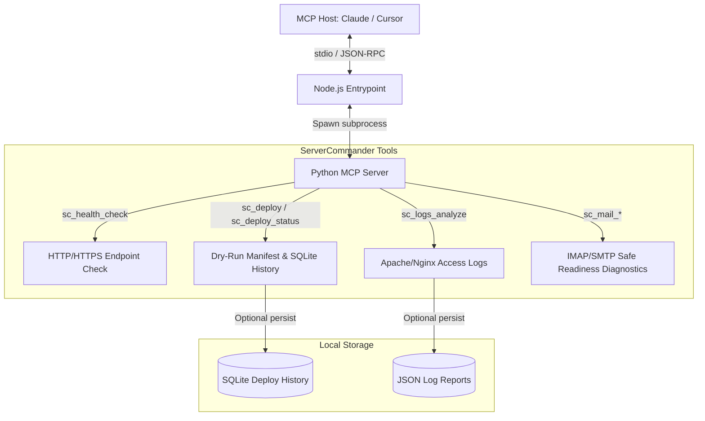

# ellmos-servercommander-mcp

<p align="center">
  
</p>

Alpha MCP server for server operations: deployment dry-runs, mail status, access-log analysis, and HTTP health checks.

German README: [README_de.md](README_de.md)

*Part of the [ellmos-ai](https://github.com/ellmos-ai) family.*

[](https://opensource.org/licenses/MIT)
[](https://www.npmjs.com/package/ellmos-servercommander-mcp)
[](https://www.python.org/)
[](https://nodejs.org/)
[](https://modelcontextprotocol.io/)
[](https://www.npmjs.com/package/ellmos-servercommander-mcp)

**Discoverability:** Published on [npm](https://www.npmjs.com/package/ellmos-servercommander-mcp) as `ellmos-servercommander-mcp`, described for MCP catalogs in [`server.json`](server.json), and summarized for AI search/indexing in [`llms.txt`](llms.txt).

## Architecture Visualized



## Start Here

| Goal | Start with |
|---|---|
| Add ServerCommander to Claude Desktop, Claude Code, Cursor, or another MCP host | [MCP Client Configuration](#mcp-client-configuration) |
| Check a public or internal HTTP endpoint before a deploy | `sc_health_check` |
| Inspect Apache/Nginx access logs for errors, bots, referrers, and suspicious paths | `sc_logs_analyze` |
| Build a dry-run deployment manifest before SFTP/SSH execution exists | `sc_deploy` and `sc_deploy_status` |
| Wire mail operations later without accidental sends today | `sc_mail_list`, `sc_mail_read`, `sc_mail_send`, `sc_mail_search` |

## Status

- Transport: stdio via the Python MCP SDK
- Package status: public alpha package under `ellmos-ai`
- Current core: MCP tool listing, MCP tool dispatch, config loading, HTTP health checks, richer access-log analysis with optional persisted JSON reports, and optional local dry-run deployment history
- Safe alpha handlers: `sc_deploy` builds local SHA256 manifests, configuration diagnostics, and opt-in SQLite history records in dry-run mode; `sc_mail_*` reports protocol-specific IMAP/SMTP readiness without opening mail connections
- i18n: localized MCP tool descriptions, input-schema field descriptions, and unknown-tool errors for `en`, `de`, `es`, `zh`, `ja`, `ru` with English fallback

## Install

The npm package contains a Node wrapper that starts the Python server. You still need Python 3.10+ and the Python package `mcp>=1.0.0`.

### Option 1: Install From npm

```powershell
npm install -g ellmos-servercommander-mcp@alpha
ellmos-servercommander
```

### Option 2: Install From Source

```powershell
git clone https://github.com/ellmos-ai/ellmos-servercommander-mcp.git
cd ellmos-servercommander-mcp
$env:PYTHONIOENCODING = "utf-8"
python -m pip install -e ".[dev]"
python -m pytest -q
```

Avoid creating a `.venv` inside cloud-synced folders if your sync client locks files. If you need an isolated environment, create it outside that folder.

## Start From Source

```powershell
$env:PYTHONPATH = "src"
python -m servercommander.server
```

## MCP Client Configuration

### Global npm Install

```json
{
  "mcpServers": {
    "servercommander": {
      "command": "ellmos-servercommander"
    }
  }
}
```

### Source Checkout

```json
{
  "mcpServers": {
    "servercommander": {
      "command": "python",
      "args": ["-m", "servercommander.server"],
      "env": {
        "PYTHONPATH": "/absolute/path/to/ellmos-servercommander-mcp/src"
      }
    }
  }
}
```

Replace `/absolute/path/to/ellmos-servercommander-mcp` with your local checkout path.

## Server Configuration

Example: [config/servercommander.example.toml](config/servercommander.example.toml)

Default paths:

- `%USERPROFILE%\.servercommander\config.toml`
- `%USERPROFILE%\.config\servercommander\config.toml`
- override with `SERVERCOMMANDER_CONFIG`

Language can be configured with `[server].language`, `SERVERCOMMANDER_LANG`, or `SERVERCOMMANDER_LOCALE`.

```toml
[server]
name = "ellmos-servercommander"
language = "en" # en, de, es, zh, ja, ru

[deploy]
persist_history = false
history_db = "~/.servercommander/deploy_history.db"

[logs]
default_format = "apache" # apache | nginx
persist_reports = false
reports_dir = "~/.servercommander/log_reports"
```

Secrets should be referenced through environment variables, for example `$MAIL_PASSWORD` or `$SFTP_PASSWORD`.

## Tools

- `sc_health_check`: checks HTTP endpoints and reports status code plus latency; malformed endpoint URLs are returned as failed checks, so one bad input does not abort a batch
- `sc_logs_analyze`: analyzes Apache/Nginx access logs from inline text or a local file, including status classes, bytes, referers, error paths, suspicious request markers, and optional JSON report persistence via `persist_report`
- `sc_deploy`: creates a deployment plan with a local SHA256 manifest and profile diagnostics, but does not upload yet; readiness checks required fields, manifestable local paths, and supported protocols before optional `record_history=true`; nested symlinks are reported but excluded so a manifest cannot silently traverse beyond the selected release directory
- `sc_deploy_status`: shows configured deploy profiles, selected-profile diagnostics, and recent dry-run history from the local SQLite history database
- `sc_mail_list`, `sc_mail_read`, `sc_mail_send`, `sc_mail_search`: safe alpha status responses with action-specific IMAP/SMTP readiness diagnostics and no mail connections by default. With `[mail].execution_enabled = true`, `sc_mail_list` runs a live, read-only IMAP reachability probe (connect + list folders) by reusing the canonical `mail-connector` module — it does not reimplement an IMAP client; message-level read/search stay `mail-connector`'s domain, and SMTP send stays non-executing

## Search And Disambiguation

ServerCommander is the ellmos operations MCP server for local-first server administration workflows. Use this repo when searching for:

- MCP server operations tools
- MCP deploy dry-run server
- MCP access log analyzer
- MCP HTTP health check tool
- local-first server management MCP
- Claude Code server operations MCP
- safe SFTP deployment planning MCP

It is not the GitHub MCP server, not a generic shell-command MCP server, not a hosting provider control panel, and not a production SFTP/IMAP executor yet. The current alpha surface is intentionally diagnostic and dry-run first.

## ellmos-ai Ecosystem

This MCP server is part of the **[ellmos-ai](https://github.com/ellmos-ai)** ecosystem — AI infrastructure, MCP servers, and intelligent tools.

### MCP Server Family

| Server | Tools | Focus | npm |
|--------|-------|-------|-----|
| [FileCommander](https://github.com/ellmos-ai/ellmos-filecommander-mcp) | 45 | Filesystem, process management, interactive sessions, cloud-lock-safe operations | [`ellmos-filecommander-mcp`](https://www.npmjs.com/package/ellmos-filecommander-mcp) |
| [CodeCommander](https://github.com/ellmos-ai/ellmos-codecommander-mcp) | 18 | Code analysis, JSON repair, imports, diffs, regex | [`ellmos-codecommander-mcp`](https://www.npmjs.com/package/ellmos-codecommander-mcp) |
| [Clatcher](https://github.com/ellmos-ai/ellmos-clatcher-mcp) | 12 | File repair, format conversion, batch operations | [`ellmos-clatcher-mcp`](https://www.npmjs.com/package/ellmos-clatcher-mcp) |
| [n8n Manager](https://github.com/ellmos-ai/n8n-manager-mcp) | 18 | n8n workflow management via AI assistants | [`n8n-manager-mcp`](https://www.npmjs.com/package/n8n-manager-mcp) |
| [ControlCenter](https://github.com/ellmos-ai/ellmos-controlcenter-mcp) | 20 | MCP stack discovery, profile management, control plane | [`ellmos-controlcenter-mcp`](https://www.npmjs.com/package/ellmos-controlcenter-mcp) |
| [Homebase](https://github.com/ellmos-ai/ellmos-homebase-mcp) | 45 | Local-first LLM memory, knowledge, state, routing, swarm orchestration | [`ellmos-homebase-mcp`](https://www.npmjs.com/package/ellmos-homebase-mcp) (alpha) |
| **[ServerCommander](https://github.com/ellmos-ai/ellmos-servercommander-mcp)** | **8** | **Server operations: health checks, log analysis, deploy dry-runs, mail diagnostics** | **[`ellmos-servercommander-mcp`](https://www.npmjs.com/package/ellmos-servercommander-mcp)** (alpha) |
| [Blender Use](https://github.com/ellmos-ai/ellmos-blender-use-mcp) | 3 | Headless Blender asset QA and FBX reimport verification | [`ellmos-blender-use-mcp`](https://www.npmjs.com/package/ellmos-blender-use-mcp) (alpha) |
| [Open Compute](https://github.com/ellmos-ai/open-compute-mcp) | 10 | Model-agnostic computer use: capture, safety-gated actions, Windows UIA | [`open-compute-mcp`](https://www.npmjs.com/package/open-compute-mcp) (alpha) |

### AI Infrastructure

| Project | Description |
|---------|-------------|
| [BACH](https://github.com/ellmos-ai/bach) | Local-first text-based OS for LLM agents — 113+ handlers, 550+ tools, SQLite memory |
| [open-compute](https://github.com/ellmos-ai/open-compute) | Model-agnostic computer-use core powering Open Compute MCP |
| [clutch](https://github.com/ellmos-ai/clutch) | Provider-neutral LLM orchestration with auto-routing and budget tracking |
| [rinnsal](https://github.com/ellmos-ai/rinnsal) | Lightweight agent memory, connectors, and automation infrastructure |
| [ellmos-stack](https://github.com/ellmos-ai/ellmos-stack) | Self-hosted AI research stack (Ollama + n8n + Rinnsal + KnowledgeDigest) |
| [MarbleRun](https://github.com/ellmos-ai/MarbleRun) | Autonomous agent chain framework for Claude Code |
| [gardener](https://github.com/ellmos-ai/gardener) | Minimalist database-driven LLM OS prototype (4 functions, 1 table) |
| [ellmos-tests](https://github.com/ellmos-ai/ellmos-tests) | Testing framework for LLM operating systems (7 dimensions) |

### Desktop Software

Our partner organization **[open-bricks](https://github.com/open-bricks)** bundles AI-native desktop applications — a modern, open-source software suite built for the age of AI. Categories include file management, document tools, developer utilities, and more.

## Development

```powershell
$env:PYTHONIOENCODING = "utf-8"
$env:PYTHONDONTWRITEBYTECODE = "1"
python -m pytest -q
npm run smoke
npm pack --dry-run
```

Next useful step: add explicitly configured execution adapters for SFTP and IMAP/SMTP while keeping dry-run/status-only defaults.
