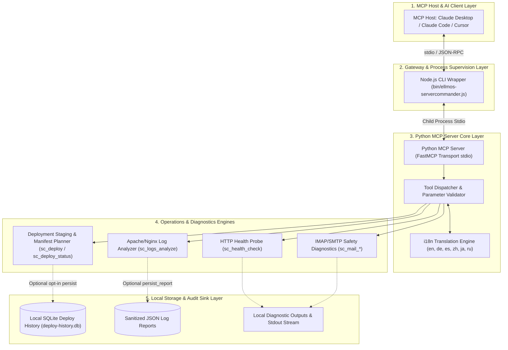
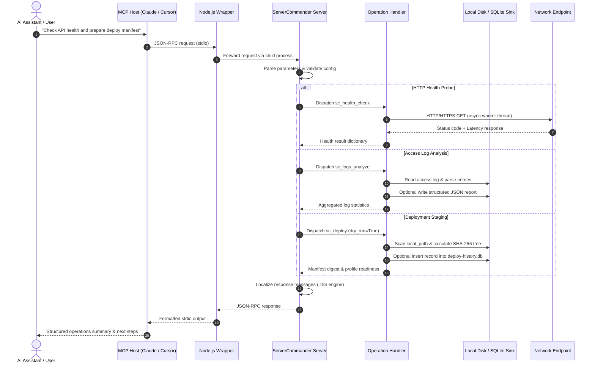

<p align="center">
  
</p>

# ellmos-servercommander-mcp

Alpha Model Context Protocol (MCP) server for local-first server operations: deployment dry-runs, mail configuration status, access-log analysis, and resilient HTTP health checks.

German README: [README_de.md](README_de.md)

*Part of the [ellmos-ai](https://github.com/ellmos-ai) family under the [open-bricks](https://github.com/open-bricks) open-source umbrella.*

[](https://opensource.org/licenses/MIT)
[](https://www.npmjs.com/package/ellmos-servercommander-mcp)
[](.github/workflows/ci.yml)
[](tests/)
[](https://www.python.org/)
[](https://nodejs.org/)
[](.github/workflows/ci.yml)
[](https://modelcontextprotocol.io/)
[](https://www.npmjs.com/package/ellmos-servercommander-mcp)
[](SECURITY.md)
[-blue.svg)](SECURITY.md)
[](https://github.com/ellmos-ai)
[](https://github.com/open-bricks)
[](llms.txt)

> [!NOTE]
> **Discoverability & AI Search:** Published on [npm](https://www.npmjs.com/package/ellmos-servercommander-mcp) as `ellmos-servercommander-mcp`, cataloged for MCP ecosystems in [`server.json`](server.json), [`glama.json`](glama.json), and [`smithery.yaml`](smithery.yaml), and indexed for AI/LLM search in [`llms.txt`](llms.txt).

---

## Quick Navigation

- [Architecture Visualized](#architecture-visualized)
- [Start Here](#start-here)
- [Key Capabilities & Safety Invariants](#key-capabilities--safety-invariants)
- [Status & Protocol Support](#status--protocol-support)
- [Installation](#installation)
- [MCP Client Configuration](#mcp-client-configuration)
- [Configuration & Profiles](#configuration--profiles)
- [Tools & Handlers](#tools--handlers)
- [End-to-End Operations Lifecycle](#end-to-end-operations-lifecycle)
- [Search And Disambiguation](#search-and-disambiguation)
- [Sibling Ecosystem](#sibling-ecosystem)
- [Development & Verification](#development--verification)
- [Security & Governance](#security--governance)

---

## Architecture Visualized


```mermaid
flowchart TD
    subgraph HostLayer ["1. MCP Host & AI Client Layer"]
        Host["MCP Host: Claude Desktop / Claude Code / Cursor"]
    end

    subgraph GatewayLayer ["2. Gateway & Process Supervision Layer"]
        NodeWrapper["Node.js CLI Wrapper (bin/ellmos-servercommander.js)"]
    end

    subgraph CoreLayer ["3. Python MCP Server Core Layer"]
        FastMCP["Python MCP Server (FastMCP Transport stdio)"]
        Dispatcher["Tool Dispatcher & Parameter Validator"]
        i18nEngine["i18n Translation Engine (en, de, es, zh, ja, ru)"]
    end

    subgraph OperationsLayer ["4. Operations & Diagnostics Engines"]
        HTTPProbe["HTTP Health Probe (sc_health_check)"]
        LogAnalyzer["Apache/Nginx Log Analyzer (sc_logs_analyze)"]
        DeployStaging["Deployment Staging & Manifest Planner (sc_deploy / sc_deploy_status)"]
        MailDiagnostics["IMAP/SMTP Safety Diagnostics (sc_mail_*)"]
    end

    subgraph SinkLayer ["5. Local Storage & Audit Sink Layer"]
        SQLiteHist[("Local SQLite Deploy History (deploy-history.db)")]
        JSONReports[("Sanitized JSON Log Reports")]
        AuditSink["Local Diagnostic Outputs & Stdout Stream"]
    end

    Host <-->|"stdio / JSON-RPC"| NodeWrapper
    NodeWrapper <-->|"Child Process Stdio"| FastMCP
    FastMCP --> Dispatcher
    Dispatcher <--> i18nEngine
    Dispatcher --> HTTPProbe
    Dispatcher --> LogAnalyzer
    Dispatcher --> DeployStaging
    Dispatcher --> MailDiagnostics
    DeployStaging -.->|"Optional opt-in persist"| SQLiteHist
    LogAnalyzer -.->|"Optional persist_report"| JSONReports
    HTTPProbe -.-> AuditSink
    MailDiagnostics -.-> AuditSink
```

---

## Start Here

| Goal | Start with | Key Features |
|---|---|---|
| Add ServerCommander to Claude Desktop, Claude Code, Cursor, or another MCP host | [MCP Client Configuration](#mcp-client-configuration) | Zero-friction global npm install or npx invocation |
| Check a public or internal HTTP endpoint before a deploy | `sc_health_check` | Concurrent non-blocking requests, latency timings, resilient batch error handling |
| Inspect Apache/Nginx access logs for errors, bots, referrers, and suspicious paths | `sc_logs_analyze` | Status code breakdown, byte transfer sums, bot markers, optional JSON reports |
| Build a deterministic dry-run deployment manifest before SFTP/SSH execution | `sc_deploy` and `sc_deploy_status` | Recursive SHA-256 tree hashing, symlink bypass protection, SQLite history |
| Wire mail operations later without accidental email dispatches today | `sc_mail_list`, `sc_mail_read`, `sc_mail_send`, `sc_mail_search` | Protocol readiness validation, credential inspection, safe alpha staging |

---

## Key Capabilities & Safety Invariants

| Capability / Invariant | Implementation Guarantee | Technical Details |
|---|---|---|
| **100% Local-First & Dry-Run Staging** | Strict non-destructive default | Deployment tools calculate SHA-256 hashes locally without executing unauthorized remote writes. |
| **Unprivileged Execution (Non-Elevation)** | Zero root/administrator requirements | Runs entirely within standard user permissions; never requires sudo or privilege elevation. |
| **Secret & Credential Isolation** | Zero-leak release packaging | `.env`, `.npmrc`, `.pypirc`, private keys (`id_rsa`, `*.pem`), and tokens are excluded by `.gitignore` and `.npmignore`. |
| **Deterministic Manifest Verification** | Cryptographic release integrity | Calculates recursive SHA-256 digests; nested symlinks are tracked but excluded from tree traversal. |
| **Resilient Health Probes** | Non-blocking batch worker threads | HTTP probes execute via `asyncio.to_thread` with strict timeouts; malformed URLs never abort batches. |
| **Structured Log Breakdown** | Local forensic inspection | Parses Common/Combined log formats; detects HTTP 4xx/5xx spikes, bots, suspicious traversal attempts. |
| **Mail Readiness Diagnostic** | Non-executing safe staging | Reuses verified `mail-connector` module for IMAP probes only when explicitly configured; SMTP send stays disabled. |
| **6-Language i18n Engine** | Comprehensive multilingual support | Full localization for tool descriptions, schema arguments, and errors in `en`, `de`, `es`, `zh`, `ja`, `ru`. |

---

## Status & Protocol Support

- **Transport**: Standard I/O (`stdio`) via the Python MCP SDK and Node.js process wrapper.
- **Package Status**: Public alpha package under the `ellmos-ai` organization.
- **Current Core**: MCP tool listing, tool dispatch, TOML configuration loader, HTTP health checks, richer access-log analysis with optional persisted JSON reports, and optional local dry-run deployment history.
- **Safe Alpha Handlers**: `sc_deploy` builds local SHA-256 manifests, configuration diagnostics, and opt-in SQLite history records in dry-run mode; `sc_mail_*` reports protocol-specific IMAP/SMTP readiness without opening mail connections by default.
- **i18n Localization**: Localized MCP tool descriptions, input-schema field descriptions, and unknown-tool errors for `en`, `de`, `es`, `zh`, `ja`, `ru` with automatic English fallback.

---

## Installation

The npm package contains a Node wrapper that starts the Python server. You still need Python 3.10+ and the Python package `mcp>=1.0.0`.

### Option 1: Install From npm

```powershell
npm install -g ellmos-servercommander-mcp@alpha
ellmos-servercommander
```

### Option 2: Install From Source

```powershell
git clone https://github.com/ellmos-ai/ellmos-servercommander-mcp.git
cd ellmos-servercommander-mcp
$env:PYTHONIOENCODING = "utf-8"
python -m pip install -e ".[dev]"
python -m pytest -q
```

Avoid creating a `.venv` inside cloud-synced folders if your sync client locks files. If you need an isolated environment, create it outside that folder.

---

## MCP Client Configuration

### Global npm Install

```json
{
  "mcpServers": {
    "servercommander": {
      "command": "ellmos-servercommander"
    }
  }
}
```

### npx Without Global Install

```json
{
  "mcpServers": {
    "servercommander": {
      "command": "npx",
      "args": ["-y", "ellmos-servercommander-mcp@alpha"]
    }
  }
}
```

### Direct Python Execution

```json
{
  "mcpServers": {
    "servercommander": {
      "command": "python",
      "args": ["-m", "servercommander.server"],
      "env": {
        "PYTHONPATH": "C:/path/to/ellmos-servercommander-mcp/src",
        "SERVERCOMMANDER_CONFIG_PATH": "C:/path/to/config/servercommander.toml"
      }
    }
  }
}
```

---

## Configuration & Profiles

ServerCommander searches for configuration files in this hierarchical order:

1. Environment variable `SERVERCOMMANDER_CONFIG_PATH`
2. `./servercommander.toml`
3. `./config/servercommander.toml`
4. `~/.config/servercommander/servercommander.toml`

An annotated template is included at [`config/servercommander.example.toml`](config/servercommander.example.toml).

```toml
[server]
name = "servercommander"
log_level = "INFO"
language = "en"

[deploy.profiles.staging]
target = "sftp://staging.example.com/var/www/app"
local_path = "./dist"
protocol = "sftp"
dry_run = true
record_history = true

[mail]
execution_enabled = false
smtp_host = "smtp.example.com"
smtp_port = 587
imap_host = "imap.example.com"
imap_port = 993
```

Secrets should always be referenced through environment variables, for example `$MAIL_PASSWORD` or `$SFTP_PASSWORD`.

---

## Tools & Handlers

- `sc_health_check`: Checks HTTP/HTTPS endpoints and reports status codes, response headers, and latency. Malformed endpoint URLs are captured gracefully as failed checks rather than aborting the batch.
- `sc_logs_analyze`: Analyzes Apache/Nginx access logs from inline text or local files, reporting HTTP status classes (2xx/3xx/4xx/5xx), total bytes transferred, top referrers, 404/500 error paths, suspicious bot markers, and optional JSON report persistence via `persist_report`.
- `sc_deploy`: Creates a dry-run deployment plan with a local SHA-256 manifest and profile diagnostics without performing remote mutations. Nested symbolic links are tracked as `skipped_symlinks` to prevent unexpected directory traversal.
- `sc_deploy_status`: Displays configured deployment profiles, profile diagnostics, and recent dry-run deployment records retrieved from the local SQLite history database.
- `sc_mail_list`, `sc_mail_read`, `sc_mail_send`, `sc_mail_search`: Safe alpha status responses with action-specific IMAP/SMTP readiness diagnostics. With `[mail].execution_enabled = true`, `sc_mail_list` executes a read-only IMAP reachability probe (connect + folder listing) by reusing the canonical `mail-connector` module without reimplementing an IMAP client.

---

## End-to-End Operations Lifecycle


```mermaid
sequenceDiagram
    autonumber
    actor User as AI Assistant / User
    participant Host as MCP Host (Claude / Cursor)
    participant Wrapper as Node.js Wrapper
    participant Server as ServerCommander Server
    participant Handler as Operation Handler
    participant Disk as Local Disk / SQLite Sink
    participant Target as Network Endpoint

    User->>Host: "Check API health and prepare deploy manifest"
    Host->>Wrapper: JSON-RPC request (stdio)
    Wrapper->>Server: Forward request via child process
    Server->>Server: Parse parameters & validate config

    alt HTTP Health Probe
        Server->>Handler: Dispatch sc_health_check
        Handler->>Target: HTTP/HTTPS GET (async worker thread)
        Target-->>Handler: Status code + Latency response
        Handler-->>Server: Health result dictionary
    else Access Log Analysis
        Server->>Handler: Dispatch sc_logs_analyze
        Handler->>Disk: Read access.log & parse entries
        Handler->>Disk: Optional write structured JSON report
        Handler-->>Server: Aggregated log statistics
    else Deployment Staging
        Server->>Handler: Dispatch sc_deploy (dry_run=True)
        Handler->>Disk: Scan local_path & calculate SHA-256 tree
        Handler->>Disk: Optional insert record into deploy-history.db
        Handler-->>Server: Manifest digest & profile readiness
    end

    Server->>Server: Localize response messages (i18n engine)
    Server-->>Wrapper: JSON-RPC response
    Wrapper-->>Host: Formatted stdio output
    Host-->>User: Structured operations summary & next steps
```

---

## Search And Disambiguation

ServerCommander is the ellmos operations MCP server for local-first server administration workflows. Use this repository when searching for:

- MCP server operations tools
- MCP deploy dry-run server
- MCP access log analyzer
- MCP HTTP health check tool
- local-first server management MCP
- Claude Code server operations MCP
- safe SFTP deployment planning MCP
- AI assistant server preflight checks
- Apache Nginx log analysis MCP
- resilient HTTP health check MCP
- SQLite deploy history MCP

It is **not** the GitHub MCP server, **not** a generic arbitrary shell-execution MCP server, **not** a cloud hosting provider control panel, and **not** an unverified production SFTP/IMAP auto-executor. The current alpha surface is intentionally diagnostic, dry-run first, and safe by default.

---

## Sibling Ecosystem

This MCP server is an integral component of the **[ellmos-ai](https://github.com/ellmos-ai)** ecosystem and the **[open-bricks](https://github.com/open-bricks)** open-source software family.

### MCP Server Family

| Server | Tools | Primary Focus | npm Package |
|---|---|---|---|
| [FileCommander](https://github.com/ellmos-ai/ellmos-filecommander-mcp) | 46 | Filesystem operations, process supervision, sessions, cloud-lock handling | [`ellmos-filecommander-mcp`](https://www.npmjs.com/package/ellmos-filecommander-mcp) |
| [CodeCommander](https://github.com/ellmos-ai/ellmos-codecommander-mcp) | 22 | Code analysis, AST inspection, JSON repair, imports, diffs, regex | [`ellmos-codecommander-mcp`](https://www.npmjs.com/package/ellmos-codecommander-mcp) |
| [Clatcher](https://github.com/ellmos-ai/ellmos-clatcher-mcp) | 12 | File repair, encoding correction, format conversion, batch tools | [`ellmos-clatcher-mcp`](https://www.npmjs.com/package/ellmos-clatcher-mcp) |
| [n8n Manager](https://github.com/ellmos-ai/n8n-manager-mcp) | 18 | n8n workflow management, deployment, node exploration | [`n8n-manager-mcp`](https://www.npmjs.com/package/n8n-manager-mcp) |
| [ControlCenter](https://github.com/ellmos-ai/ellmos-controlcenter-mcp) | 20 | MCP stack discovery, profile management, control plane routing | [`ellmos-controlcenter-mcp`](https://www.npmjs.com/package/ellmos-controlcenter-mcp) |
| [Homebase](https://github.com/ellmos-ai/ellmos-homebase-mcp) | 45 | Local-first LLM memory, knowledge base, swarm orchestration | [`ellmos-homebase-mcp`](https://www.npmjs.com/package/ellmos-homebase-mcp) |
| **[ServerCommander](https://github.com/ellmos-ai/ellmos-servercommander-mcp)** | **8** | **Server operations: health checks, log analysis, dry-run manifests** | **[`ellmos-servercommander-mcp`](https://www.npmjs.com/package/ellmos-servercommander-mcp)** |
| [Blender Use](https://github.com/ellmos-ai/ellmos-blender-use-mcp) | 3 | Headless Blender 3D asset QA and automated FBX reimport | [`ellmos-blender-use-mcp`](https://www.npmjs.com/package/ellmos-blender-use-mcp) |
| [Open Compute](https://github.com/ellmos-ai/open-compute-mcp) | 10 | Model-agnostic computer use: screen capture, safety-gated actions | [`open-compute-mcp`](https://www.npmjs.com/package/open-compute-mcp) |

### AI Infrastructure & Developer Tools

| Project | Description |
|---|---|
| [BACH](https://github.com/ellmos-ai/bach) | Local-first text-based OS for LLM agents — 113+ handlers, 550+ tools, SQLite memory |
| [open-compute](https://github.com/ellmos-ai/open-compute) | Model-agnostic computer-use core powering Open Compute MCP |
| [clutch](https://github.com/ellmos-ai/clutch) | Provider-neutral LLM orchestration with auto-routing and budget tracking |
| [rinnsal](https://github.com/ellmos-ai/rinnsal) | Lightweight agent memory, connectors, and automation infrastructure |
| [sqlite-transit-sync](https://github.com/ellmos-ai/sqlite-transit-sync) | Encrypted SQLite transit synchronization & additive read-replica engine |
| [workflowhooker](https://github.com/ellmos-ai/workflowhooker) | Git-hook-driven workflow automation and execution safety boundaries |
| [system-explorer](https://github.com/ellmos-ai/system-explorer) | Local-first system composition, module introspection, and fleet verification |
| [companion-for-agy](https://github.com/ellmos-ai/companion-for-agy) | Antigravity developer companion & telemetry bridge |

### Desktop Software Suite

Our partner organization **[open-bricks](https://github.com/open-bricks)** provides desktop productivity applications built for the age of AI:
- File Management: [ProFiler](https://github.com/file-bricks/ProFiler), [ExplorerPro](https://github.com/file-bricks/ExplorerPro), [CloudLockFixer](https://github.com/file-bricks/CloudLockFixer)
- Document Processing: [DokuZen](https://github.com/doc-bricks/DokuZen), [PDFtoPDFocr](https://github.com/doc-bricks/PDFtoPDFocr), [FormularErstellen](https://github.com/doc-bricks/FormularErstellen)
- Developer Tools: [DevCenter](https://github.com/dev-bricks/DevCenter), [CodeBox](https://github.com/dev-bricks/CodeBox), [automizer-for-claude-desktop](https://github.com/dev-bricks/automizer-for-claude-desktop)

---

## Development & Verification

```powershell
# Set UTF-8 encoding
$env:PYTHONIOENCODING = "utf-8"

# Run complete pytest test suite
python -m pytest -v

# Run Ruff linter
ruff check .

# Verify Node CLI smoke test
npm run smoke

# Verify npm packaging (dry-run)
npm pack --dry-run
```

---

## Security & Governance

For vulnerability reporting, response SLAs, and local-first security invariant details, see our bilingual [SECURITY.md](SECURITY.md).

- **Vulnerability Reporting**: [GitHub Security Advisories](https://github.com/ellmos-ai/ellmos-servercommander-mcp/security/advisories) or email `security@ellmos.ai` / `security@open-bricks.org`.
- **Response SLA**: Initial triage within **48 hours**; status updates within 5 business days.
