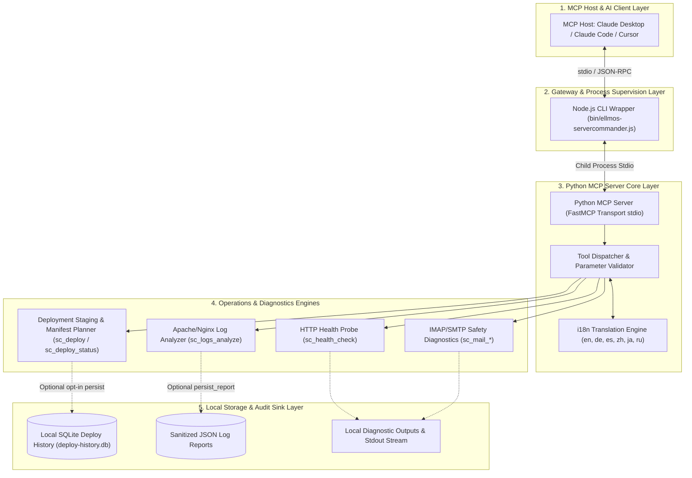
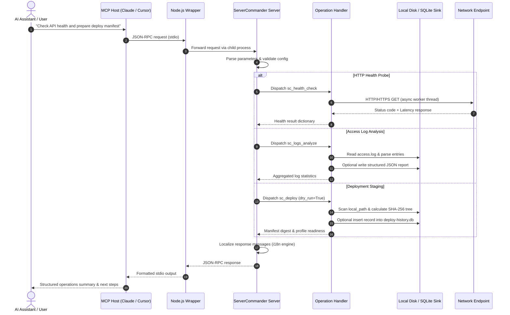

<p align="center">
  
</p>

# ellmos-servercommander-mcp

Alpha Model Context Protocol (MCP) server for local-first server operations: deployment dry-runs, mail configuration status, access-log analysis, and resilient HTTP health checks.

German README: [README_de.md](README_de.md)

*Part of the [ellmos-ai](https://github.com/ellmos-ai) family under the [open-bricks](https://github.com/open-bricks) open-source umbrella.*

[](https://opensource.org/licenses/MIT)
[](https://www.npmjs.com/package/ellmos-servercommander-mcp)
[](.github/workflows/ci.yml)
[](tests/)
[](https://www.python.org/)
[](https://nodejs.org/)
[](.github/workflows/ci.yml)
[](https://modelcontextprotocol.io/)
[](https://www.npmjs.com/package/ellmos-servercommander-mcp)
[](SECURITY.md)
[](THIRD_PARTY_LICENSES.md)
[](THIRD_PARTY_LICENSES.md)
[](MARKETING-LOG.txt)
[-blue.svg)](SECURITY.md)
[](https://github.com/ellmos-ai)
[](https://github.com/open-bricks)
[](llms.txt)

> [!NOTE]
> **Discoverability & AI Search:** Published on [npm](https://www.npmjs.com/package/ellmos-servercommander-mcp) as `ellmos-servercommander-mcp`, cataloged for MCP ecosystems in [`server.json`](server.json), [`glama.json`](glama.json), and [`smithery.yaml`](smithery.yaml), and indexed for AI/LLM search in [`llms.txt`](llms.txt).

---

## Quick Navigation

1. [Executive Summary & Core Identity](#core-identity)
2. [Visual Architecture & System Topology](#architecture-visualized)
3. [Operations Lifecycle & Execution Sequence Flow](#end-to-end-operations-lifecycle)
4. [Target Personas & High-Intent SEO Queries](#marketing--target-personas)
5. [Comparative Matrix vs. Alternatives](#comparative-matrix--alternatives)
6. [Key Capabilities & Safety Invariants](#key-capabilities--safety-invariants)
7. [Start Here & Quick Guidance](#start-here)
8. [Status & Protocol Support](#status--protocol-support)
9. [Installation & Prerequisites](#installation)
10. [MCP Client Configuration & Deployment Modes](#mcp-client-configuration)
11. [Configuration & Profiles Specification](#configuration--profiles)
12. [Tools & Handlers Reference](#tools--handlers)
13. [Search, Disambiguation & Discovery Keywords](#search-and-disambiguation)
14. [Sibling Ecosystem Matrix](#sibling-ecosystem)
15. [Third-Party Licenses & Level 1 SBOM](#third-party-licenses--transparency)
16. [Security Policy & Operational Limits (48h SLA)](#security--governance)
17. [Development, Verification & CI Matrix](#development--verification)
18. [Statutory Notice, Liability Limitation & License (§ 521 BGB)](#statutory-notice--liability-limitation)

---

<a id="core-identity"></a><a id="executive-summary--core-identity"></a>
## 1. Executive Summary & Core Identity

`ellmos-servercommander-mcp` is an authoritative, local-first Model Context Protocol (MCP) server engineered specifically for AI coding assistants and autonomous agent platforms (Claude Code, Cursor, Codex, Antigravity, Gemini). It enables agents to safely diagnose server health, analyze web server access logs, inspect mail readiness, and build dry-run deployment plans without exposing production infrastructure to unverified, destructive mutations or arbitrary shell execution.

Every operation is governed by strict local-first and zero-elevation guarantees:
- **100% Local-First & Zero-Egress by Default:** Diagnostic parsing and manifest hashing execute locally; zero telemetry and zero unverified outbound network requests.
- **Dry-Run & Staging First:** Deployment operations calculate SHA-256 tree digests and check target profiles before any remote command is staged.
- **Unprivileged Execution (`RunAsInvoker`):** Operates within standard unprivileged user space without requiring root or administrator elevation.

---

<a id="architecture-visualized"></a><a id="visual-architecture--system-topology"></a>
## 2. Visual Architecture & System Topology

The following diagram illustrates the decoupled layers of ServerCommander, from MCP host transport and Node.js process supervision to Python dispatching, operational engines, and local persistence sinks:


```mermaid
flowchart TD
    subgraph HostLayer ["1. MCP Host & AI Client Layer"]
        Host["MCP Host: Claude Desktop / Claude Code / Cursor"]
    end

    subgraph GatewayLayer ["2. Gateway & Process Supervision Layer"]
        NodeWrapper["Node.js CLI Wrapper (bin/ellmos-servercommander.js)"]
    end

    subgraph CoreLayer ["3. Python MCP Server Core Layer"]
        FastMCP["Python MCP Server (FastMCP Transport stdio)"]
        Dispatcher["Tool Dispatcher & Parameter Validator"]
        i18nEngine["i18n Translation Engine (en, de, es, zh, ja, ru)"]
    end

    subgraph OperationsLayer ["4. Operations & Diagnostics Engines"]
        HTTPProbe["HTTP Health Probe (sc_health_check)"]
        LogAnalyzer["Apache/Nginx Log Analyzer (sc_logs_analyze)"]
        DeployStaging["Deployment Staging & Manifest Planner (sc_deploy / sc_deploy_status)"]
        MailDiagnostics["IMAP/SMTP Safety Diagnostics (sc_mail_*)"]
    end

    subgraph SinkLayer ["5. Local Storage & Audit Sink Layer"]
        SQLiteHist[("Local SQLite Deploy History (deploy-history.db)")]
        JSONReports[("Sanitized JSON Log Reports")]
        AuditSink["Local Diagnostic Outputs & Stdout Stream"]
    end

    Host <-->|"stdio / JSON-RPC"| NodeWrapper
    NodeWrapper <-->|"Child Process Stdio"| FastMCP
    FastMCP --> Dispatcher
    Dispatcher <--> i18nEngine
    Dispatcher --> HTTPProbe
    Dispatcher --> LogAnalyzer
    Dispatcher --> DeployStaging
    Dispatcher --> MailDiagnostics
    DeployStaging -.->|"Optional opt-in persist"| SQLiteHist
    LogAnalyzer -.->|"Optional persist_report"| JSONReports
    HTTPProbe -.-> AuditSink
    MailDiagnostics -.-> AuditSink
```

---

<a id="end-to-end-operations-lifecycle"></a><a id="operations-lifecycle--execution-sequence-flow"></a>
## 3. Operations Lifecycle & Execution Sequence Flow

The following sequence diagram demonstrates the lifecycle of operations dispatched by an AI agent through ServerCommander, showing concurrent HTTP probing, log parsing, and dry-run manifest calculation:


```mermaid
sequenceDiagram
    autonumber
    actor User as AI Assistant / User
    participant Host as MCP Host (Claude / Cursor)
    participant Wrapper as Node.js Wrapper
    participant Server as ServerCommander Server
    participant Handler as Operation Handler
    participant Disk as Local Disk / SQLite Sink
    participant Target as Network Endpoint

    User->>Host: "Check API health and prepare deploy manifest"
    Host->>Wrapper: JSON-RPC request (stdio)
    Wrapper->>Server: Forward request via child process
    Server->>Server: Parse parameters & validate config

    alt HTTP Health Probe
        Server->>Handler: Dispatch sc_health_check
        Handler->>Target: HTTP/HTTPS GET (async worker thread)
        Target-->>Handler: Status code + Latency response
        Handler-->>Server: Health result dictionary
    else Access Log Analysis
        Server->>Handler: Dispatch sc_logs_analyze
        Handler->>Disk: Read access.log & parse entries
        Handler->>Disk: Optional write structured JSON report
        Handler-->>Server: Aggregated log statistics
    else Deployment Staging
        Server->>Handler: Dispatch sc_deploy (dry_run=True)
        Handler->>Disk: Scan local_path & calculate SHA-256 tree
        Handler->>Disk: Optional insert record into deploy-history.db
        Handler-->>Server: Manifest digest & profile readiness
    end

    Server->>Server: Localize response messages (i18n engine)
    Server-->>Wrapper: JSON-RPC response
    Wrapper-->>Host: Formatted stdio output
    Host-->>User: Structured operations summary & next steps
```

---

<a id="marketing--target-personas"></a><a id="target-personas--high-intent-seo-queries"></a>
## 4. Target Personas & High-Intent SEO Queries

ServerCommander MCP bridges the critical gap between hazardous raw shell execution and opaque hosting control panels. It equips AI agents with safe, structured diagnostic capabilities for system administration.

### Target Personas

| Persona ID | Target Persona | Key Challenges & Pain Points | ServerCommander MCP Solution |
|---|---|---|---|
| `[PERSONA-01]` | **Autonomous AI Agent Engineers & Tooling Architects** | High risk of destructive bash commands during agent exploration | Structured JSON-RPC MCP tools with strict non-destructive defaults |
| `[PERSONA-02]` | **DevOps & Site Reliability Engineers (SREs)** | Undetected file drifts, broken releases, and unsafe sync operations | Deterministic SHA-256 tree hashing and local dry-run deployment plans |
| `[PERSONA-03]` | **Security-Conscious System Administrators & SecOps** | Credential leakage, root elevation risks, and suspicious traffic bursts | Unprivileged RunAsInvoker execution, secret isolation & forensic log analysis |
| `[PERSONA-04]` | **Solo Developers & Full-Stack Maintainers** | Tedious manual health monitoring and repetitive log grepping | Instant HTTP health checks and automated bot/error analysis from IDE |

### High-Intent Search & SEO Queries

- `"mcp server operations tools"`
- `"mcp deploy dry-run server"`
- `"mcp access log analyzer"`
- `"mcp http health check tool"`
- `"local-first server management mcp"`
- `"claude code server operations mcp"`
- `"safe sftp deployment planning mcp"`
- `"ai assistant server preflight checks"`
- `"apache nginx log analysis mcp"`
- `"resilient http health check mcp"`
- `"sqlite deploy history mcp"`

---

<a id="comparative-matrix--alternatives"></a><a id="comparative-matrix-vs-alternatives"></a>
## 5. Comparative Matrix vs. Alternatives

The 10-dimension matrix below contrasts ServerCommander against common server administration approaches, mapped directly to its runtime and governance invariants (`INV-LOCAL-01` through `INV-SLA-10`):

| Dimension | Invariant | ServerCommander MCP | SSH / Raw Bash Scripts | Heavy Web Panels (cPanel) | Cloud SaaS APM (Datadog) | Generic Terminal MCP |
|:---|:---:|---|---|---|---|---|
| **1. AI-Native Tool Calling** | `INV-I18N-08` | Direct stdio / JSON-RPC schemas | Requires fragile prompt glue | None / Web browser only | Custom API webhooks | Raw unstructured text |
| **2. Safe Staging & Dry-Run** | `INV-DRY-02` | Default `dry_run=True` + SHA-256 tree | High risk of destructive typo | Opaque web mutation | Read-only agent metrics | Arbitrary command danger |
| **3. Local-First & Zero-Egress** | `INV-LOCAL-01` | 100% Local / Zero telemetry | Local / Direct remote | Remote host web portal | Constant outbound telemetry | Local shell execution |
| **4. Privilege Requirements** | `INV-PRIV-06` | Unprivileged `RunAsInvoker` | Often requires sudo / root | Full root system daemon | Root daemon / system agent | Inherits host shell rights |
| **5. Forensic Log Analysis** | `INV-LOG-03` | Regex token parsing + bot audit | Manual grep / awk / sed | Basic UI log viewer | Heavy proprietary agent | Raw grep output |
| **6. Resilient HTTP Probes** | `INV-PROBE-04` | Non-blocking thread + batch safe | curl loop (fails on 1st error) | Periodic polling check | Centralized external probe | curl CLI subprocess |
| **7. Mail Safety Staging** | `INV-MAIL-05` | Readiness check without send | Direct mail command risk | Webmail interface | Email alert service | Blind mailx invocation |
| **8. Process & CWD Isolation** | `INV-SEC-07` | `PYTHONSAFEPATH=1` defense | Shell inherits rogue CWD | Fixed daemon user | Sandboxed system service | Inherits caller environment |
| **9. Cloud-Sync Conflict Defense** | `INV-SYNC-09` | Built-in gitignore & lock guards | None (git-only) | Database state only | Cloud-hosted dashboard | None |
| **10. Security SLA & Governance** | `INV-SLA-10` | 48h SLA via security@ellmos.ai | Community / self-supported | Vendor commercial support | Enterprise commercial SLA | Unmaintained community |

---

<a id="key-capabilities--safety-invariants"></a><a id="governance--safety-invariants"></a>
## 6. Key Capabilities & Safety Invariants

| Invariant | Capability / Rule | Implementation Guarantee | Technical Details |
|---|---|---|---|
| **INV-LOCAL-01** | **100% Local-First & Zero-Egress** | Non-destructive diagnostic default | Diagnostics & dry-run planning run locally without unauthorized remote telemetry. |
| **INV-DRY-02** | **Fail-Safe Deployment Staging** | Default `dry_run=True` | Calculates SHA-256 tree digests and verifies profiles before touching targets. |
| **INV-LOG-03** | **Sanitized Access-Log Analysis** | Forensic read-only parsing | Regex token extraction detects errors, bots, and path traversal without secret leaks. |
| **INV-PROBE-04** | **Resilient Health Probes** | Non-blocking worker threads | HTTP probes execute via `asyncio.to_thread`; invalid endpoints never abort batches. |
| **INV-MAIL-05** | **Dry-Run Mail Configuration Status** | Safe non-executing staging | Validates IMAP/SMTP configuration and credentials without accidental dispatches. |
| **INV-PRIV-06** | **Unprivileged RunAsInvoker** | Zero root/sudo elevation (Non-Elevation) | Runs entirely within standard user permissions; zero administrator rights required. |
| **INV-SEC-07** | **Safe Process & Package Isolation** | Rogue package defense | Launcher enforces `PYTHONSAFEPATH=1` to prevent cwd package hijacking. |
| **INV-I18N-08** | **Native 6-Language i18n Engine** | Comprehensive multilingual parity | Localized tool descriptions, schema arguments, and errors for `en`, `de`, `es`, `zh`, `ja`, `ru`. |
| **INV-SYNC-09** | **Cloud-Sync Conflict Hardening** | Multi-host gitignore defense | Hardened against OneDrive/Dropbox sync copies (`*-conflict-*`) and multi-agent locks (`LOCK*`). |
| **INV-SLA-10** | **Bilingual Security SLA** | 48h triage guarantee | Vulnerability response within 48 hours via `security@ellmos.ai` and `security@open-bricks.org`. |

---

<a id="start-here"></a><a id="quick-guidance"></a>
## 7. Start Here & Quick Guidance

| Goal | Start with | Key Features |
|---|---|---|
| Add ServerCommander to Claude Desktop, Claude Code, Cursor, or another MCP host | [MCP Client Configuration](#mcp-client-configuration) | Zero-friction global npm install or npx invocation |
| Check a public or internal HTTP endpoint before a deploy | `sc_health_check` | Concurrent non-blocking requests, latency timings, resilient batch error handling |
| Inspect Apache/Nginx access logs for errors, bots, referrers, and suspicious paths | `sc_logs_analyze` | Status code breakdown, byte transfer sums, bot markers, optional JSON reports |
| Build a deterministic dry-run deployment manifest before SFTP/SSH execution | `sc_deploy` and `sc_deploy_status` | Recursive SHA-256 tree hashing, symlink bypass protection, SQLite history |
| Wire mail operations later without accidental email dispatches today | `sc_mail_list`, `sc_mail_read`, `sc_mail_send`, `sc_mail_search` | Protocol readiness validation, credential inspection, safe alpha staging |

---

<a id="status--protocol-support"></a>
## 8. Status & Protocol Support

- **Transport**: Standard I/O (`stdio`) via the Python MCP SDK and Node.js process wrapper.
- **Package Status**: Public alpha package under the `ellmos-ai` organization.
- **Current Core**: MCP tool listing, tool dispatch, TOML configuration loader, HTTP health checks, richer access-log analysis with optional persisted JSON reports, and optional local dry-run deployment history.
- **Safe Alpha Handlers**: `sc_deploy` builds local SHA-256 manifests, configuration diagnostics, and opt-in SQLite history records in dry-run mode; `sc_mail_*` reports protocol-specific IMAP/SMTP readiness without opening mail connections by default.
- **i18n Localization**: Localized MCP tool descriptions, input-schema field descriptions, and unknown-tool errors for `en`, `de`, `es`, `zh`, `ja`, `ru` with automatic English fallback.

---

<a id="installation"></a><a id="installation--prerequisites"></a>
## 9. Installation & Prerequisites

The npm package contains a Node wrapper that starts the Python server. You still need Python 3.10+ and the Python package `mcp>=1.0.0`.

### Option 1: Install From npm

```powershell
npm install -g ellmos-servercommander-mcp@alpha
ellmos-servercommander
```

### Option 2: Install From Source

```powershell
git clone https://github.com/ellmos-ai/ellmos-servercommander-mcp.git
cd ellmos-servercommander-mcp
$env:PYTHONIOENCODING = "utf-8"
python -m pip install -e ".[dev]"
python -m pytest -q
```

Avoid creating a `.venv` inside cloud-synced folders if your sync client locks files. If you need an isolated environment, create it outside that folder.

---

<a id="mcp-client-configuration"></a><a id="mcp-client-deployment-modes"></a>
## 10. MCP Client Configuration & Deployment Modes

### Global npm Install

```json
{
  "mcpServers": {
    "servercommander": {
      "command": "ellmos-servercommander"
    }
  }
}
```

### npx Without Global Install

```json
{
  "mcpServers": {
    "servercommander": {
      "command": "npx",
      "args": ["-y", "ellmos-servercommander-mcp@alpha"]
    }
  }
}
```

### Direct Python Execution

```json
{
  "mcpServers": {
    "servercommander": {
      "command": "python",
      "args": ["-m", "servercommander.server"],
      "env": {
        "PYTHONPATH": "C:/path/to/ellmos-servercommander-mcp/src",
        "SERVERCOMMANDER_CONFIG_PATH": "C:/path/to/config/servercommander.toml"
      }
    }
  }
}
```

---

<a id="configuration--profiles"></a><a id="configuration--profiles-specification"></a>
## 11. Configuration & Profiles Specification

ServerCommander searches for configuration files in this hierarchical order:

1. Environment variable `SERVERCOMMANDER_CONFIG_PATH`
2. `./servercommander.toml`
3. `./config/servercommander.toml`
4. `~/.config/servercommander/servercommander.toml`

An annotated template is included at [`config/servercommander.example.toml`](config/servercommander.example.toml).

```toml
[server]
name = "servercommander"
log_level = "INFO"
language = "en"

[deploy.profiles.staging]
target = "sftp://staging.example.com/var/www/app"
local_path = "./dist"
protocol = "sftp"
dry_run = true
record_history = true

[mail]
execution_enabled = false
smtp_host = "smtp.example.com"
smtp_port = 587
imap_host = "imap.example.com"
imap_port = 993
```

Secrets should always be referenced through environment variables, for example `$MAIL_PASSWORD` or `$SFTP_PASSWORD`.

---

<a id="tools--handlers"></a><a id="tool-handlers-reference"></a>
## 12. Tools & Handlers Reference

- `sc_health_check`: Checks HTTP/HTTPS endpoints and reports status codes, response headers, and latency. Malformed endpoint URLs are captured gracefully as failed checks rather than aborting the batch.
- `sc_logs_analyze`: Analyzes Apache/Nginx access logs from inline text or local files, reporting HTTP status classes (2xx/3xx/4xx/5xx), total bytes transferred, top referrers, 404/500 error paths, suspicious bot markers, and optional JSON report persistence via `persist_report`.
- `sc_deploy`: Creates a dry-run deployment plan with a local SHA-256 manifest and profile diagnostics without performing remote mutations. Nested symbolic links are tracked as `skipped_symlinks` to prevent unexpected directory traversal.
- `sc_deploy_status`: Displays configured deployment profiles, profile diagnostics, and recent dry-run deployment records retrieved from the local SQLite history database.
- `sc_mail_list`, `sc_mail_read`, `sc_mail_send`, `sc_mail_search`: Safe alpha status responses with action-specific IMAP/SMTP readiness diagnostics. With `[mail].execution_enabled = true`, `sc_mail_list` executes a read-only IMAP reachability probe (connect + folder listing) by reusing the canonical `mail-connector` module without reimplementing an IMAP client.

---

<a id="search-and-disambiguation"></a><a id="search-disambiguation--discovery-keywords"></a>
## 13. Search, Disambiguation & Discovery Keywords

ServerCommander is the ellmos operations MCP server for local-first server administration workflows. Use this repository when searching for:

- MCP server operations tools
- MCP deploy dry-run server
- MCP access log analyzer
- MCP HTTP health check tool
- local-first server management MCP
- Claude Code server operations MCP
- safe SFTP deployment planning MCP
- AI assistant server preflight checks
- Apache Nginx log analysis MCP
- resilient HTTP health check MCP
- SQLite deploy history MCP

It is **not** the GitHub MCP server, **not** a generic arbitrary shell-execution MCP server, **not** a cloud hosting provider control panel, and **not** an unverified production SFTP/IMAP auto-executor. The current alpha surface is intentionally diagnostic, dry-run first, and safe by default.

---

<a id="sibling-ecosystem"></a><a id="sibling-ecosystem-matrix"></a>
## 14. Sibling Ecosystem Matrix

This MCP server is an integral component of the **[ellmos-ai](https://github.com/ellmos-ai)** ecosystem and the **[open-bricks](https://github.com/open-bricks)** open-source software family.

### MCP Server Family

| Server | Tools | Primary Focus | npm Package |
|---|---|---|---|
| [FileCommander](https://github.com/ellmos-ai/ellmos-filecommander-mcp) | 46 | Filesystem operations, process supervision, sessions, cloud-lock handling | [`ellmos-filecommander-mcp`](https://www.npmjs.com/package/ellmos-filecommander-mcp) |
| [CodeCommander](https://github.com/ellmos-ai/ellmos-codecommander-mcp) | 22 | Code analysis, AST inspection, JSON repair, imports, diffs, regex | [`ellmos-codecommander-mcp`](https://www.npmjs.com/package/ellmos-codecommander-mcp) |
| [Clatcher](https://github.com/ellmos-ai/ellmos-clatcher-mcp) | 12 | File repair, encoding correction, format conversion, batch tools | [`ellmos-clatcher-mcp`](https://www.npmjs.com/package/ellmos-clatcher-mcp) |
| [n8n Manager](https://github.com/ellmos-ai/n8n-manager-mcp) | 18 | n8n workflow management, deployment, node exploration | [`n8n-manager-mcp`](https://www.npmjs.com/package/n8n-manager-mcp) |
| [ControlCenter](https://github.com/ellmos-ai/ellmos-controlcenter-mcp) | 20 | MCP stack discovery, profile management, control plane routing | [`ellmos-controlcenter-mcp`](https://www.npmjs.com/package/ellmos-controlcenter-mcp) |
| [Homebase](https://github.com/ellmos-ai/ellmos-homebase-mcp) | 45 | Local-first LLM memory, knowledge base, swarm orchestration | [`ellmos-homebase-mcp`](https://www.npmjs.com/package/ellmos-homebase-mcp) |
| **[ServerCommander](https://github.com/ellmos-ai/ellmos-servercommander-mcp)** | **8** | **Server operations: health checks, log analysis, dry-run manifests** | **[`ellmos-servercommander-mcp`](https://www.npmjs.com/package/ellmos-servercommander-mcp)** |
| [Blender Use](https://github.com/ellmos-ai/ellmos-blender-use-mcp) | 3 | Headless Blender 3D asset QA and automated FBX reimport | [`ellmos-blender-use-mcp`](https://www.npmjs.com/package/ellmos-blender-use-mcp) |
| [Open Compute](https://github.com/ellmos-ai/open-compute-mcp) | 10 | Model-agnostic computer use: screen capture, safety-gated actions | [`open-compute-mcp`](https://www.npmjs.com/package/open-compute-mcp) |

### AI Infrastructure & Developer Tools

| Project | Description |
|---|---|
| [BACH](https://github.com/ellmos-ai/bach) | Local-first text-based OS for LLM agents — 113+ handlers, 550+ tools, SQLite memory |
| [open-compute](https://github.com/ellmos-ai/open-compute) | Model-agnostic computer-use core powering Open Compute MCP |
| [clutch](https://github.com/ellmos-ai/clutch) | Provider-neutral LLM orchestration with auto-routing and budget tracking |
| [rinnsal](https://github.com/ellmos-ai/rinnsal) | Lightweight agent memory, connectors, and automation infrastructure |
| [sqlite-transit-sync](https://github.com/ellmos-ai/sqlite-transit-sync) | Encrypted SQLite transit synchronization & additive read-replica engine |
| [workflowhooker](https://github.com/ellmos-ai/workflowhooker) | Git-hook-driven workflow automation and execution safety boundaries |
| [system-explorer](https://github.com/ellmos-ai/system-explorer) | Local-first system composition, module introspection, and fleet verification |
| [companion-for-agy](https://github.com/ellmos-ai/companion-for-agy) | Antigravity developer companion & telemetry bridge |

### Desktop Software Suite

Our partner organization **[open-bricks](https://github.com/open-bricks)** provides desktop productivity applications built for the age of AI:
- File Management: [ProFiler](https://github.com/file-bricks/ProFiler), [ExplorerPro](https://github.com/file-bricks/ExplorerPro), [CloudLockFixer](https://github.com/file-bricks/CloudLockFixer)
- Document Processing: [DokuZen](https://github.com/doc-bricks/DokuZen), [PDFtoPDFocr](https://github.com/doc-bricks/PDFtoPDFocr), [FormularErstellen](https://github.com/doc-bricks/FormularErstellen)
- Developer Tools: [DevCenter](https://github.com/dev-bricks/DevCenter), [CodeBox](https://github.com/dev-bricks/CodeBox), [automizer-for-claude-desktop](https://github.com/dev-bricks/automizer-for-claude-desktop)

---

<a id="third-party-licenses--transparency"></a><a id="third-party-licenses--level-1-sbom"></a>
## 15. Third-Party Licenses & Level 1 SBOM

ellmos ServerCommander MCP is strictly built upon permissive open-source foundations. We maintain zero hidden telemetry, zero proprietary binary blobs, and zero unverified dynamic dependencies.

- **Direct Runtime**: Python MCP SDK (`mcp>=1.0.0`, MIT License, Anthropic PBC), Python Standard Library (PSFL-2.0).
- **Node CLI Wrapper**: `update-notifier` (BSD-2-Clause, Sindre Sorhus) for non-intrusive CLI update checks.
- **Optional Extensions**: `paramiko` (LGPL-2.1) dynamically imported only when the optional `[sftp]` extra is explicitly installed.
- **Developer Tooling**: `pytest` (MIT), `pytest-asyncio` (Apache-2.0), `ruff` (MIT/Apache-2.0), `hatchling` (MIT).
- **Audit Ledger & Level 1 SBOM**: Comprehensive license disclosures, full copyright notices, and local-first compliance assurances are documented in [THIRD_PARTY_LICENSES.md](THIRD_PARTY_LICENSES.md). Formal repository attribution is preserved in [NOTICE](NOTICE).

---

<a id="security--governance"></a><a id="security-policy--operational-limits"></a>
## 16. Security Policy & Operational Limits (48h SLA)

For vulnerability reporting, response SLAs, and local-first security invariant details, see our bilingual [SECURITY.md](SECURITY.md).

- **Vulnerability Reporting**: [GitHub Security Advisories](https://github.com/ellmos-ai/ellmos-servercommander-mcp/security/advisories) or email `security@ellmos.ai` / `security@open-bricks.org`.
- **Response SLA**: Initial triage within **48 hours**; status updates within 5 business days.

---

<a id="development--verification"></a><a id="development-verification--ci-matrix"></a>
## 17. Development, Verification & CI Matrix

```powershell
# Set UTF-8 encoding
$env:PYTHONIOENCODING = "utf-8"

# Run complete pytest test suite
python -m pytest -v

# Run Ruff linter
ruff check .

# Verify Node CLI smoke test
npm run smoke

# Verify npm packaging (dry-run)
npm pack --dry-run
```

---

<a id="statutory-notice--liability-limitation"></a><a id="license"></a>
## 18. Statutory Notice, Liability Limitation & License (§ 521 BGB)

### Statutory Disclaimer (§ 521 BGB Gefälligkeitsrecht)

Dieses Open-Source-Softwareprodukt wird als **unentgeltliche Schenkung** im Sinne der §§ 516 ff. BGB bereitgestellt. Gemäß **§ 521 BGB** ist die Haftung des Urhebers und der Beitragenden auf **Vorsatz und grobe Fahrlässigkeit** beschränkt. Ergänzend gelten die nachstehenden Haftungsausschlüsse der MIT-Lizenz.

Nutzung auf eigenes Risiko. Keine Wartungsverpflichtung, keine Verfügbarkeitszusicherung, keine Gewähr für Fehlerfreiheit oder Eignung für einen bestimmten Einsatzzweck.

### English Summary

This project is an unpaid open-source donation. In accordance with § 521 of the German Civil Code (BGB), liability is restricted strictly to cases of intentional misconduct and gross negligence. Supplemental liability disclaimers are set forth in the MIT License below.

Use entirely at your own risk. No maintenance commitments, no availability guarantees, and no warranties regarding fitness for any particular purpose.

### License & Attribution

Distributed under the terms of the [MIT License](LICENSE).<br>
Copyright (c) 2026 Lukas Geiger. See [LICENSE](LICENSE) and [NOTICE](NOTICE) for full details.<br>
Third-party licenses and Level 1 SBOM notices are audited in [THIRD_PARTY_LICENSES.md](THIRD_PARTY_LICENSES.md).
