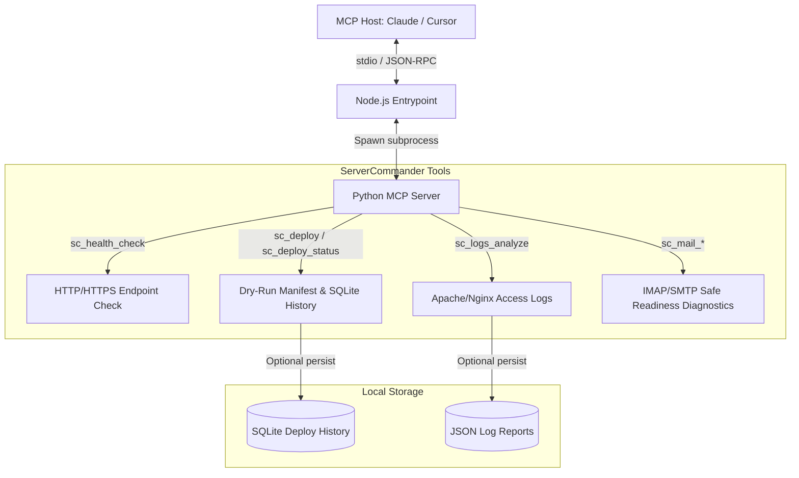

# ellmos-servercommander-mcp

<p align="center">
  
</p>

Alpha-MCP-Server für Server-Operationen: Deployment-Dry-runs, Mail-Status, Access-Log-Analyse und HTTP-Health-Checks.

Englische Standard-README: [README.md](README.md)

*Teil der [ellmos-ai](https://github.com/ellmos-ai)-Familie.*

[](https://opensource.org/licenses/MIT)
[](https://www.npmjs.com/package/ellmos-servercommander-mcp)
[](https://www.python.org/)
[](https://nodejs.org/)
[](https://modelcontextprotocol.io/)
[](https://www.npmjs.com/package/ellmos-servercommander-mcp)

**Auffindbarkeit:** Veröffentlicht auf [npm](https://www.npmjs.com/package/ellmos-servercommander-mcp) als `ellmos-servercommander-mcp`, für MCP-Kataloge in [`server.json`](server.json) beschrieben und für AI-Suche/Indexierung in [`llms.txt`](llms.txt) zusammengefasst.

## Architektur Visualisiert



## Einstieg

| Ziel | Einstieg |
|---|---|
| ServerCommander in Claude Desktop, Claude Code, Cursor oder einen anderen MCP-Host einbinden | [MCP-Client-Konfiguration](#mcp-client-konfiguration) |
| Einen öffentlichen oder internen HTTP-Endpunkt vor einem Deployment prüfen | `sc_health_check` |
| Apache-/Nginx-Access-Logs nach Fehlern, Bots, Referern und verdächtigen Pfaden prüfen | `sc_logs_analyze` |
| Vor SFTP-/SSH-Ausführung ein trockenes Deployment-Manifest bauen | `sc_deploy` und `sc_deploy_status` |
| Mail-Operationen später vorbereiten, ohne heute versehentlich zu senden | `sc_mail_list`, `sc_mail_read`, `sc_mail_send`, `sc_mail_search` |

## Status

- Transport: stdio über das Python-MCP-SDK
- Paketstatus: öffentliches Alpha-Paket unter `ellmos-ai`
- Aktiver Kern: MCP-Tool-Liste, MCP-Tool-Dispatch, Config-Lader, HTTP-Health-Checks, erweiterte Access-Log-Analyse mit optional gespeicherten JSON-Reports und optionale lokale Deployment-Dry-run-Historie
- Sichere Alpha-Handler: `sc_deploy` erstellt lokale SHA256-Manifeste, Konfigurationsdiagnosen und opt-in SQLite-History-Einträge im Dry-run, `sc_mail_*` meldet protokollspezifische IMAP-/SMTP-Bereitschaft ohne Mail-Verbindungen
- i18n: lokalisierte MCP-Tool-Beschreibungen, Input-Schema-Feldbeschreibungen und Unknown-Tool-Fehler für `en`, `de`, `es`, `zh`, `ja`, `ru` mit Englisch-Fallback

## Installation

Das npm-Paket enthält einen Node-Wrapper, der den Python-Server startet. Voraussetzung bleibt Python 3.10+ mit installiertem Python-Paket `mcp>=1.0.0`.

### Option 1: Installation per npm

```powershell
npm install -g ellmos-servercommander-mcp@alpha
ellmos-servercommander
```

### Option 2: Installation aus dem Quellcode

```powershell
git clone https://github.com/ellmos-ai/ellmos-servercommander-mcp.git
cd ellmos-servercommander-mcp
$env:PYTHONIOENCODING = "utf-8"
python -m pip install -e ".[dev]"
python -m pytest -q
```

Keine `.venv` in cloud-synchronisierten Ordnern anlegen, wenn der Sync-Client Dateien sperrt. Falls eine isolierte Umgebung gebraucht wird, außerhalb dieses Ordners erstellen.

## Start Aus Dem Quellbaum

```powershell
$env:PYTHONPATH = "src"
python -m servercommander.server
```

## MCP-Client-Konfiguration

### Globale npm-Installation

```json
{
  "mcpServers": {
    "servercommander": {
      "command": "ellmos-servercommander"
    }
  }
}
```

### Quellcode-Checkout

```json
{
  "mcpServers": {
    "servercommander": {
      "command": "python",
      "args": ["-m", "servercommander.server"],
      "env": {
        "PYTHONPATH": "/absolute/path/to/ellmos-servercommander-mcp/src"
      }
    }
  }
}
```

`/absolute/path/to/ellmos-servercommander-mcp` durch den eigenen lokalen Checkout-Pfad ersetzen.

## Server-Konfiguration

Beispiel: [config/servercommander.example.toml](config/servercommander.example.toml)

Standardpfade:

- `%USERPROFILE%\.servercommander\config.toml`
- `%USERPROFILE%\.config\servercommander\config.toml`
- Override per `SERVERCOMMANDER_CONFIG`

Die Sprache kann über `[server].language`, `SERVERCOMMANDER_LANG` oder `SERVERCOMMANDER_LOCALE` gesetzt werden.

```toml
[server]
name = "ellmos-servercommander"
language = "de" # en, de, es, zh, ja, ru

[deploy]
persist_history = false
history_db = "~/.servercommander/deploy_history.db"

[logs]
default_format = "apache" # apache | nginx
persist_reports = false
reports_dir = "~/.servercommander/log_reports"
```

Secrets sollen als Umgebungsvariablen referenziert werden, zum Beispiel `$MAIL_PASSWORD` oder `$SFTP_PASSWORD`.

## Tools

- `sc_health_check`: prüft HTTP-Endpunkte und meldet Status-Code plus Latenz; fehlerhafte Endpunkt-URLs werden als fehlgeschlagene Prüfung zurückgegeben, damit eine einzelne fehlerhafte Eingabe keinen Batch abbricht
- `sc_logs_analyze`: analysiert Apache-/Nginx-Access-Logs aus Text oder Datei, inklusive Statusklassen, Bytes, Referern, Fehlerpfaden, verdächtigen Request-Markern und optionaler JSON-Report-Speicherung per `persist_report`
- `sc_deploy`: erstellt einen Deployment-Plan mit lokalem SHA256-Manifest und Profildiagnose, führt aber noch keinen Upload aus; die Bereitschaft prüft Pflichtfelder, manifestierbare lokale Pfade und unterstützte Protokolle vor optionalem `record_history=true`; verschachtelte Symlinks werden ausgewiesen, aber ausgeschlossen, damit ein Manifest nicht unbemerkt außerhalb des gewählten Release-Ordners traversiert
- `sc_deploy_status`: zeigt konfigurierte Deploy-Profile, ausgewählte Profildiagnosen und die jüngste Dry-run-Historie aus der lokalen SQLite-History-Datenbank
- `sc_mail_list`, `sc_mail_read`, `sc_mail_send`, `sc_mail_search`: sichere Alpha-Statusantworten mit aktionsspezifischen IMAP-/SMTP-Bereitschaftsdiagnosen und standardmäßig ohne Mail-Verbindungen. Mit `[mail].execution_enabled = true` führt `sc_mail_list` eine echte, read-only IMAP-Erreichbarkeitsprobe aus (verbinden + Ordner auflisten) und **verwendet dafür das kanonische `mail-connector`-Modul wieder** — ohne einen eigenen IMAP-Client nachzubauen; Message-Level-Read/Search bleiben Domäne von `mail-connector`, und SMTP-Send bleibt ohne Ausführung

## Suche Und Abgrenzung

ServerCommander ist der ellmos-Operations-MCP-Server für lokale Serververwaltungs-Workflows. Nützliche Suchphrasen:

- MCP server operations tools
- MCP deploy dry-run server
- MCP access log analyzer
- MCP HTTP health check tool
- local-first server management MCP
- Claude Code server operations MCP
- safe SFTP deployment planning MCP

Das Repo ist nicht der GitHub-MCP-Server, kein generischer Shell-Command-MCP-Server, kein Hosting-Control-Panel und noch kein produktiver SFTP-/IMAP-Executor. Die aktuelle Alpha-Oberfläche ist bewusst diagnostisch und Dry-run-first.

## ellmos-ai-Ökosystem

Dieser MCP-Server ist Teil des **[ellmos-ai](https://github.com/ellmos-ai)**-Ökosystems — KI-Infrastruktur, MCP-Server und intelligente Werkzeuge.

### MCP-Server-Familie

| Server | Tools | Fokus | npm |
|--------|-------|-------|-----|
| [FileCommander](https://github.com/ellmos-ai/ellmos-filecommander-mcp) | 45 | Dateisystem, Prozessverwaltung, interaktive Sitzungen, Cloud-Lock-sichere Operationen | [`ellmos-filecommander-mcp`](https://www.npmjs.com/package/ellmos-filecommander-mcp) |
| [CodeCommander](https://github.com/ellmos-ai/ellmos-codecommander-mcp) | 18 | Code-Analyse, JSON-Reparatur, Imports, Diffs, Regex | [`ellmos-codecommander-mcp`](https://www.npmjs.com/package/ellmos-codecommander-mcp) |
| [Clatcher](https://github.com/ellmos-ai/ellmos-clatcher-mcp) | 12 | Dateireparatur, Formatkonvertierung, Batch-Operationen | [`ellmos-clatcher-mcp`](https://www.npmjs.com/package/ellmos-clatcher-mcp) |
| [n8n Manager](https://github.com/ellmos-ai/n8n-manager-mcp) | 18 | n8n-Workflow-Verwaltung über KI-Assistenten | [`n8n-manager-mcp`](https://www.npmjs.com/package/n8n-manager-mcp) |
| [ControlCenter](https://github.com/ellmos-ai/ellmos-controlcenter-mcp) | 20 | MCP-Stack-Discovery, Profilverwaltung, Control Plane | [`ellmos-controlcenter-mcp`](https://www.npmjs.com/package/ellmos-controlcenter-mcp) |
| [Homebase](https://github.com/ellmos-ai/ellmos-homebase-mcp) | 45 | Local-first LLM-Gedächtnis, Wissen, Zustand, Routing, Schwarm-Orchestrierung | [`ellmos-homebase-mcp`](https://www.npmjs.com/package/ellmos-homebase-mcp) (alpha) |
| **[ServerCommander](https://github.com/ellmos-ai/ellmos-servercommander-mcp)** | **8** | **Server-Operationen: Health-Checks, Log-Analyse, Deploy-Dry-Runs, Mail-Diagnose** | **[`ellmos-servercommander-mcp`](https://www.npmjs.com/package/ellmos-servercommander-mcp)** (alpha) |
| [Blender Use](https://github.com/ellmos-ai/ellmos-blender-use-mcp) | 3 | Headless Blender-Asset-QA und FBX-Reimport-Verifikation | [`ellmos-blender-use-mcp`](https://www.npmjs.com/package/ellmos-blender-use-mcp) (alpha) |
| [Open Compute](https://github.com/ellmos-ai/open-compute-mcp) | 10 | Modell-agnostischer Computer-Use: Capture, safety-gated Aktionen, Windows-UIA | [`open-compute-mcp`](https://www.npmjs.com/package/open-compute-mcp) (alpha) |

### KI-Infrastruktur

| Projekt | Beschreibung |
|---------|-------------|
| [BACH](https://github.com/ellmos-ai/bach) | Local-first textbasiertes OS für LLM-Agenten — 113+ Handler, 550+ Tools, SQLite-Memory |
| [open-compute](https://github.com/ellmos-ai/open-compute) | Modell-agnostischer Computer-Use-Kern hinter Open Compute MCP |
| [clutch](https://github.com/ellmos-ai/clutch) | Provider-neutrale LLM-Orchestrierung mit Auto-Routing und Budget-Tracking |
| [rinnsal](https://github.com/ellmos-ai/rinnsal) | Leichte Agent-Memory-, Connector- und Automatisierungsinfrastruktur |
| [ellmos-stack](https://github.com/ellmos-ai/ellmos-stack) | Self-hosted AI Research Stack (Ollama + n8n + Rinnsal + KnowledgeDigest) |
| [MarbleRun](https://github.com/ellmos-ai/MarbleRun) | Autonomes Agent-Chain-Framework für Claude Code |
| [gardener](https://github.com/ellmos-ai/gardener) | Minimalistischer datenbankgetriebener LLM-OS-Prototyp (4 Funktionen, 1 Tabelle) |
| [ellmos-tests](https://github.com/ellmos-ai/ellmos-tests) | Testframework für LLM-Betriebssysteme (7 Dimensionen) |

### Desktop-Software

Unsere Partnerorganisation **[open-bricks](https://github.com/open-bricks)** bündelt KI-native Desktop-Anwendungen: eine moderne Open-Source-Softwaresuite für Datei-, Dokumenten- und Entwicklerwerkzeuge.

## Entwicklung

```powershell
$env:PYTHONIOENCODING = "utf-8"
$env:PYTHONDONTWRITEBYTECODE = "1"
python -m pytest -q
npm run smoke
npm pack --dry-run
```

Der nächste sinnvolle Schritt ist, explizit konfigurierte Ausführungsadapter für SFTP und IMAP/SMTP zu ergänzen und Dry-run beziehungsweise Status-only als Standard beizubehalten.
