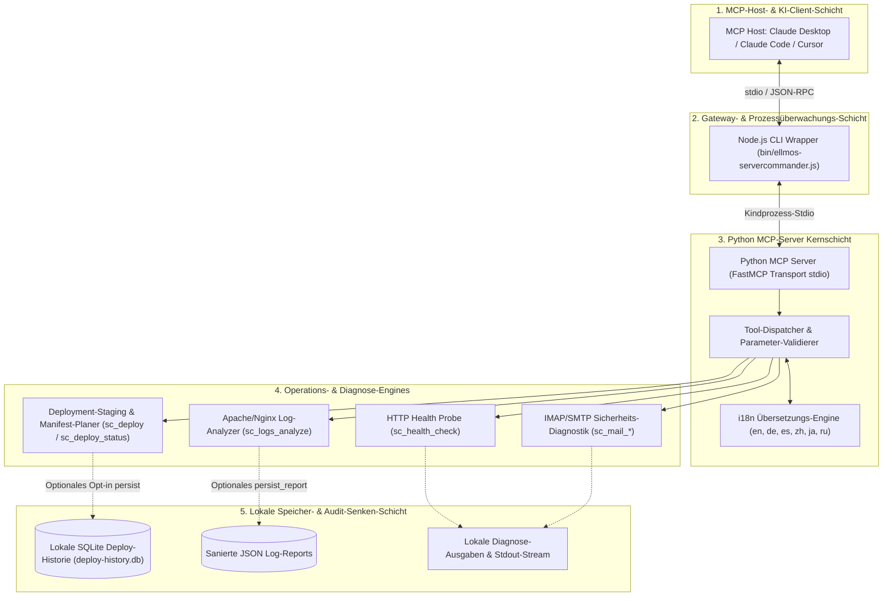
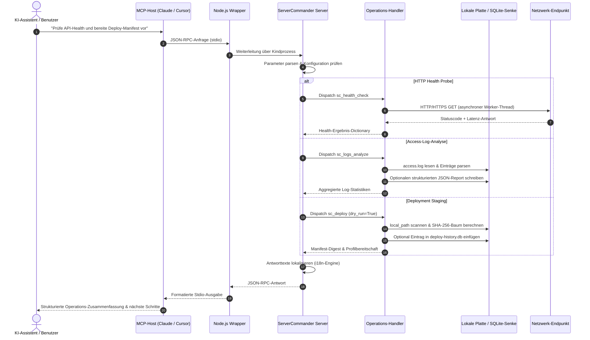

<p align="center">
  
</p>

# ellmos-servercommander-mcp

Alpha Model Context Protocol (MCP) Server für Local-First Server-Operationen: Deployment-Dry-runs, Mail-Konfigurationsstatus, Access-Log-Analyse und robuste HTTP-Health-Checks.

Englische Standard-README: [README.md](README.md)

*Teil der [ellmos-ai](https://github.com/ellmos-ai)-Familie unter dem Open-Source-Dach von [open-bricks](https://github.com/open-bricks).*

[](https://opensource.org/licenses/MIT)
[](https://www.npmjs.com/package/ellmos-servercommander-mcp)
[](.github/workflows/ci.yml)
[](tests/)
[](https://www.python.org/)
[](https://nodejs.org/)
[](.github/workflows/ci.yml)
[](https://modelcontextprotocol.io/)
[](https://www.npmjs.com/package/ellmos-servercommander-mcp)
[](SECURITY.md)
[](THIRD_PARTY_LICENSES.md)
[](MARKETING-LOG.txt)
[-blue.svg)](SECURITY.md)
[](https://github.com/ellmos-ai)
[](https://github.com/open-bricks)
[](llms.txt)

> [!NOTE]
> **Auffindbarkeit & KI-Suche:** Veröffentlicht auf [npm](https://www.npmjs.com/package/ellmos-servercommander-mcp) als `ellmos-servercommander-mcp`, für MCP-Kataloge in [`server.json`](server.json), [`glama.json`](glama.json) und [`smithery.yaml`](smithery.yaml) beschrieben und für AI-Suche/Indexierung in [`llms.txt`](llms.txt) zusammengefasst.

---

## Schnellnavigation

- [Architektur Visualisiert](#architektur-visualisiert)
- [Einstieg](#einstieg)
- [Kernfähigkeiten & Sicherheitsinvarianten](#kernfähigkeiten--sicherheitsinvarianten)
- [Status & Protokoll-Unterstützung](#status--protokoll-unterstützung)
- [Installation](#installation)
- [MCP-Client-Konfiguration](#mcp-client-konfiguration)
- [Konfiguration & Profile](#konfiguration--profile)
- [Tools & Handler](#tools--handler)
- [End-to-End Operations-Lebenszyklus](#end-to-end-operations-lebenszyklus)
- [Suche & Begriffsklärung](#suche--Begriffsklärung)
- [Geschwister-Ökosystem](#geschwister-ökosystem)
- [Entwicklung & Verifikation](#entwicklung--verifikation)
- [Drittanbieter-Lizenzen & Transparenz](#drittanbieter-lizenzen--transparenz)
- [Marketing & Zielgruppen](#marketing--zielgruppen)
- [Sicherheit & Richtlinien](#sicherheit--richtlinien)

---

## Architektur Visualisiert


```mermaid
flowchart TD
    subgraph HostLayer ["1. MCP-Host- & KI-Client-Schicht"]
        Host["MCP Host: Claude Desktop / Claude Code / Cursor"]
    end

    subgraph GatewayLayer ["2. Gateway- & Prozessüberwachungs-Schicht"]
        NodeWrapper["Node.js CLI Wrapper (bin/ellmos-servercommander.js)"]
    end

    subgraph CoreLayer ["3. Python MCP-Server Kernschicht"]
        FastMCP["Python MCP Server (FastMCP Transport stdio)"]
        Dispatcher["Tool-Dispatcher & Parameter-Validierer"]
        i18nEngine["i18n Übersetzungs-Engine (en, de, es, zh, ja, ru)"]
    end

    subgraph OperationsLayer ["4. Operations- & Diagnose-Engines"]
        HTTPProbe["HTTP Health Probe (sc_health_check)"]
        LogAnalyzer["Apache/Nginx Log-Analyzer (sc_logs_analyze)"]
        DeployStaging["Deployment-Staging & Manifest-Planer (sc_deploy / sc_deploy_status)"]
        MailDiagnostics["IMAP/SMTP Sicherheits-Diagnostik (sc_mail_*)"]
    end

    subgraph SinkLayer ["5. Lokale Speicher- & Audit-Senken-Schicht"]
        SQLiteHist[("Lokale SQLite Deploy-Historie (deploy-history.db)")]
        JSONReports[("Sanierte JSON Log-Reports")]
        AuditSink["Lokale Diagnose-Ausgaben & Stdout-Stream"]
    end

    Host <-->|"stdio / JSON-RPC"| NodeWrapper
    NodeWrapper <-->|"Kindprozess-Stdio"| FastMCP
    FastMCP --> Dispatcher
    Dispatcher <--> i18nEngine
    Dispatcher --> HTTPProbe
    Dispatcher --> LogAnalyzer
    Dispatcher --> DeployStaging
    Dispatcher --> MailDiagnostics
    DeployStaging -.->|"Optionales Opt-in persist"| SQLiteHist
    LogAnalyzer -.->|"Optionales persist_report"| JSONReports
    HTTPProbe -.-> AuditSink
    MailDiagnostics -.-> AuditSink
```

---

## Einstieg

| Ziel | Einstieg | Kernfunktionen |
|---|---|---|
| ServerCommander in Claude Desktop, Claude Code, Cursor oder einen anderen MCP-Host einbinden | [MCP-Client-Konfiguration](#mcp-client-konfiguration) | Reibungslose globale npm-Installation oder npx-Aufruf |
| Einen öffentlichen oder internen HTTP-Endpunkt vor einem Deployment prüfen | `sc_health_check` | Parallele, nicht blockierende Anfragen, Latenzmessung, fehlertolerante Batch-Verarbeitung |
| Apache-/Nginx-Access-Logs nach Fehlern, Bots, Referern und verdächtigen Pfaden prüfen | `sc_logs_analyze` | Statuscode-Aufschlüsselung, Datenübertragungssummen, Bot-Erkennung, optionale JSON-Reports |
| Vor SFTP-/SSH-Ausführung ein deterministisches Deployment-Manifest im Dry-Run erstellen | `sc_deploy` und `sc_deploy_status` | Rekursives SHA-256-Baumhashing, Symlink-Traversierungsschutz, SQLite-Historie |
| Mail-Operationen vorbereiten, ohne heute versehentlich E-Mails zu versenden | `sc_mail_list`, `sc_mail_read`, `sc_mail_send`, `sc_mail_search` | Protokollbereitschaftsprüfung, Credential-Inspektion, sicheres Alpha-Staging |

---

## Kernfähigkeiten & Sicherheitsinvarianten

| Invariante | Fähigkeit / Regel | Implementierungs-Garantie | Technische Details |
|---|---|---|---|
| **INV-LOCAL-01** | **100% Local-First & Zero-Egress** | Zerstörungsfreier diagnostischer Standard | Diagnosen & Dry-run-Planung laufen lokal ohne unautorisierte Remote-Telemetrie. |
| **INV-DRY-02** | **Ausfallsicheres Deployment-Staging** | Standard `dry_run=True` | Berechnet SHA-256-Manifeste und prüft Profile, bevor Zielsysteme berührt werden. |
| **INV-LOG-03** | **Bereinigte Access-Log-Analyse** | Forensisches Read-Only-Parsing | Regex-Token-Extraktion erkennt Fehler, Bots und Pfadtraversierungen ohne Secret-Leaks. |
| **INV-PROBE-04** | **Robuste Health-Probes** | Nicht-blockierende Worker-Threads | HTTP-Checks laufen via `asyncio.to_thread`; ungültige URLs brechen Batches niemals ab. |
| **INV-MAIL-05** | **Sichere Mail-Bereitschaftsdiagnose** | Ausführungsfreies sicheres Staging | Validiert IMAP/SMTP-Konfiguration und Logins ohne versehentlichen E-Mail-Versand. |
| **INV-PRIV-06** | **Rechtefreie Ausführung (Non-Elevation)** | Keine Root-/sudo-Rechte (RunAsInvoker) | Läuft vollständig mit regulären Nutzerrechten; erfordert niemals Administratorrechte. |
| **INV-SEC-07** | **Sichere Prozess- & Paketisolation** | Schutz vor Fremdpaketen im CWD | Launcher erzwingt `PYTHONSAFEPATH=1`, um Hijacking durch Arbeitsverzeichnispakete zu verhindern. |
| **INV-I18N-08** | **Native 6-Sprachen i18n Engine** | Vollständige mehrsprachige Parität | Lokalisierte Toolbeschreibungen, Schema-Argumente und Fehler für `en`, `de`, `es`, `zh`, `ja`, `ru`. |
| **INV-SYNC-09** | **Cloud-Sync-Konflikthärtung** | Multi-Host .gitignore-Abwehr | Gehärtet gegen OneDrive-/Dropbox-Konfliktkopien (`*-conflict-*`) und Multi-Agent-Locks (`LOCK*`). |
| **INV-SLA-10** | **Zweisprachige Sicherheits-SLA** | 48h Reaktionsgarantie | Schwachstellenmeldung mit 48h-Triage via `security@ellmos.ai` und `security@open-bricks.org`. |

---

## Status & Protokoll-Unterstützung

- **Transport**: Standard-Ein-/Ausgabe (`stdio`) über das Python-MCP-SDK und Node.js-Prozess-Wrapper.
- **Paketstatus**: Öffentliches Alpha-Paket unter der `ellmos-ai`-Organisation.
- **Aktiver Kern**: MCP-Tool-Listing, Tool-Dispatch, TOML-Konfigurationslader, HTTP-Health-Checks, erweiterte Access-Log-Analyse mit optional gespeicherten JSON-Reports und optionale lokale Deployment-Dry-run-Historie.
- **Sichere Alpha-Handler**: `sc_deploy` erstellt lokale SHA-256-Manifeste, Konfigurationsdiagnosen und opt-in SQLite-History-Einträge im Dry-Run-Modus; `sc_mail_*` meldet protokollspezifische IMAP-/SMTP-Bereitschaft ohne Standard-Verbindungsaufbau.
- **i18n-Lokalisierung**: Lokalisierte MCP-Tool-Beschreibungen, Input-Schema-Feldbeschreibungen und Unknown-Tool-Fehler für `en`, `de`, `es`, `zh`, `ja`, `ru` mit automatischem Englisch-Fallback.

---

## Installation

Das npm-Paket enthält einen Node-Wrapper, der den Python-Server startet. Voraussetzung bleibt Python 3.10+ mit installiertem Python-Paket `mcp>=1.0.0`.

### Option 1: Installation per npm

```powershell
npm install -g ellmos-servercommander-mcp@alpha
ellmos-servercommander
```

### Option 2: Installation aus dem Quellcode

```powershell
git clone https://github.com/ellmos-ai/ellmos-servercommander-mcp.git
cd ellmos-servercommander-mcp
$env:PYTHONIOENCODING = "utf-8"
python -m pip install -e ".[dev]"
python -m pytest -q
```

Keine `.venv` in cloud-synchronisierten Ordnern anlegen, wenn der Sync-Client Dateien sperrt. Falls eine isolierte Umgebung gebraucht wird, außerhalb dieses Ordners erstellen.

---

## MCP-Client-Konfiguration

### Globale npm-Installation

```json
{
  "mcpServers": {
    "servercommander": {
      "command": "ellmos-servercommander"
    }
  }
}
```

### npx Ohne Globale Installation

```json
{
  "mcpServers": {
    "servercommander": {
      "command": "npx",
      "args": ["-y", "ellmos-servercommander-mcp@alpha"]
    }
  }
}
```

### Direkte Python-Ausführung

```json
{
  "mcpServers": {
    "servercommander": {
      "command": "python",
      "args": ["-m", "servercommander.server"],
      "env": {
        "PYTHONPATH": "C:/path/to/ellmos-servercommander-mcp/src",
        "SERVERCOMMANDER_CONFIG_PATH": "C:/path/to/config/servercommander.toml"
      }
    }
  }
}
```

---

## Konfiguration & Profile

ServerCommander sucht Konfigurationsdateien in dieser hierarchischen Reihenfolge:

1. Umgebungsvariable `SERVERCOMMANDER_CONFIG_PATH`
2. `./servercommander.toml`
3. `./config/servercommander.toml`
4. `~/.config/servercommander/servercommander.toml`

Eine annotierte Vorlage liegt unter [`config/servercommander.example.toml`](config/servercommander.example.toml).

```toml
[server]
name = "servercommander"
log_level = "INFO"
language = "de"

[deploy.profiles.staging]
target = "sftp://staging.example.com/var/www/app"
local_path = "./dist"
protocol = "sftp"
dry_run = true
record_history = true

[mail]
execution_enabled = false
smtp_host = "smtp.example.com"
smtp_port = 587
imap_host = "imap.example.com"
imap_port = 993
```

Passwörter und Secrets sollten stets über Umgebungsvariablen wie `$MAIL_PASSWORD` oder `$SFTP_PASSWORD` referenziert werden.

---

## Tools & Handler

- `sc_health_check`: Prüft HTTP-/HTTPS-Endpunkte und meldet Statuscodes, Antwort-Header und Latenzen. Ungültige URLs werden als fehlgeschlagene Tests ausgewiesen, anstatt den Batch abzubrechen.
- `sc_logs_analyze`: Analysiert Apache-/Nginx-Access-Logs aus Inline-Text oder lokalen Dateien mit Auswertung nach Statusklassen (2xx/3xx/4xx/5xx), übertragenen Bytes, Top-Referern, 404/500-Fehlerpfaden, Bot-Mustern und optionaler JSON-Report-Persistierung über `persist_report`.
- `sc_deploy`: Erstellt einen Dry-Run-Deployment-Plan mit lokalem SHA-256-Manifest und Profil-Diagnosen ohne Remote-Mutationen. Verschachtelte Symlinks werden als `skipped_symlinks` erfasst, um unkontrollierte Traversierungen zu verhindern.
- `sc_deploy_status`: Zeigt konfigurierte Deployment-Profile, Profildiagnosen und die jüngsten Dry-Run-Einträge aus der lokalen SQLite-Historie.
- `sc_mail_list`, `sc_mail_read`, `sc_mail_send`, `sc_mail_search`: Sichere Alpha-Statusantworten mit aktionsspezifischer IMAP-/SMTP-Bereitschaftsdiagnose. Bei `[mail].execution_enabled = true` führt `sc_mail_list` einen lesenden IMAP-Erreichbarkeitstest (Connect + Ordnerauflistung) unter Wiederverwendung des kanonischen `mail-connector`-Moduls durch.

---

## End-to-End Operations-Lebenszyklus


```mermaid
sequenceDiagram
    autonumber
    actor User as KI-Assistent / Benutzer
    participant Host as MCP-Host (Claude / Cursor)
    participant Wrapper as Node.js Wrapper
    participant Server as ServerCommander Server
    participant Handler as Operations-Handler
    participant Disk as Lokale Platte / SQLite-Senke
    participant Target as Netzwerk-Endpunkt

    User->>Host: "Prüfe API-Health und bereite Deploy-Manifest vor"
    Host->>Wrapper: JSON-RPC-Anfrage (stdio)
    Wrapper->>Server: Weiterleitung über Kindprozess
    Server->>Server: Parameter parsen & Konfiguration prüfen

    alt HTTP Health Probe
        Server->>Handler: Dispatch sc_health_check
        Handler->>Target: HTTP/HTTPS GET (asynchroner Worker-Thread)
        Target-->>Handler: Statuscode + Latenz-Antwort
        Handler-->>Server: Health-Ergebnis-Dictionary
    else Access-Log-Analyse
        Server->>Handler: Dispatch sc_logs_analyze
        Handler->>Disk: access.log lesen & Einträge parsen
        Handler->>Disk: Optionalen strukturierten JSON-Report schreiben
        Handler-->>Server: Aggregierte Log-Statistiken
    else Deployment Staging
        Server->>Handler: Dispatch sc_deploy (dry_run=True)
        Handler->>Disk: local_path scannen & SHA-256-Baum berechnen
        Handler->>Disk: Optional Eintrag in deploy-history.db einfügen
        Handler-->>Server: Manifest-Digest & Profilbereitschaft
    end

    Server->>Server: Antworttexte lokalisieren (i18n-Engine)
    Server-->>Wrapper: JSON-RPC-Antwort
    Wrapper-->>Host: Formatierte Stdio-Ausgabe
    Host-->>User: Strukturierte Operations-Zusammenfassung & nächste Schritte
```

---

## Suche & Begriffsklärung

ServerCommander ist der ellmos Operations-MCP-Server für Local-First Server-Administrations-Workflows. Dieses Repository ist relevant bei der Suche nach:

- MCP Server Operations Tools
- MCP Deploy Dry-Run Server
- MCP Access Log Analyzer
- MCP HTTP Health Check Tool
- Local-First Server Management MCP
- Claude Code Server Operations MCP
- Safe SFTP Deployment Planning MCP
- AI Assistant Server Preflight Checks
- Apache Nginx Log Analysis MCP
- Resilient HTTP Health Check MCP
- SQLite Deploy History MCP

Es ist **nicht** der GitHub-MCP-Server, **kein** generischer Shell-Ausführungs-Server, **kein** Hosting-Provider-Webpanel und **kein** unkontrollierter SFTP/IMAP-Auto-Executor. Die Alpha-Oberfläche ist bewusst diagnose- und sicherheitsorientiert im Dry-Run ausgelegt.

---

## Geschwister-Ökosystem

Dieser MCP-Server ist ein Kernbaustein des **[ellmos-ai](https://github.com/ellmos-ai)**-Ökosystems und der **[open-bricks](https://github.com/open-bricks)**-Softwarefamilie.

### MCP-Server-Familie

| Server | Tools | Primärer Fokus | npm-Paket |
|---|---|---|---|
| [FileCommander](https://github.com/ellmos-ai/ellmos-filecommander-mcp) | 46 | Dateisystem-Operationen, Prozessüberwachung, interaktive Sitzungen | [`ellmos-filecommander-mcp`](https://www.npmjs.com/package/ellmos-filecommander-mcp) |
| [CodeCommander](https://github.com/ellmos-ai/ellmos-codecommander-mcp) | 22 | Code-Analyse, AST-Inspektion, JSON-Reparatur, Imports, Diffs, Regex | [`ellmos-codecommander-mcp`](https://www.npmjs.com/package/ellmos-codecommander-mcp) |
| [Clatcher](https://github.com/ellmos-ai/ellmos-clatcher-mcp) | 12 | Dateireparatur, Formatkonvertierung, Duplikaterkennung, Batch-Tools | [`ellmos-clatcher-mcp`](https://www.npmjs.com/package/ellmos-clatcher-mcp) |
| [n8n Manager](https://github.com/ellmos-ai/n8n-manager-mcp) | 18 | n8n-Workflow-Verwaltung, Deployment, Node-Exploration | [`n8n-manager-mcp`](https://www.npmjs.com/package/n8n-manager-mcp) |
| [ControlCenter](https://github.com/ellmos-ai/ellmos-controlcenter-mcp) | 20 | Lokale MCP-Erkennung, Profil-Management, Steuerungsebenen-Routing | [`ellmos-controlcenter-mcp`](https://www.npmjs.com/package/ellmos-controlcenter-mcp) |
| [Homebase](https://github.com/ellmos-ai/ellmos-homebase-mcp) | 45 | Local-First LLM-Gedächtnis, Wissensbasis, Schwarm-Orchestrierung | [`ellmos-homebase-mcp`](https://www.npmjs.com/package/ellmos-homebase-mcp) |
| **[ServerCommander](https://github.com/ellmos-ai/ellmos-servercommander-mcp)** | **8** | **Server-Operationen: Health-Checks, Log-Analyse, Dry-Run-Manifeste** | **[`ellmos-servercommander-mcp`](https://www.npmjs.com/package/ellmos-servercommander-mcp)** |
| [Blender Use](https://github.com/ellmos-ai/ellmos-blender-use-mcp) | 3 | Headless Blender 3D-Asset-QA und automatisierter FBX-Reimport | [`ellmos-blender-use-mcp`](https://www.npmjs.com/package/ellmos-blender-use-mcp) |
| [Open Compute](https://github.com/ellmos-ai/open-compute-mcp) | 10 | Modellagnostische Computernutzung: Bildschirmaufnahme, UI-Aktionen | [`open-compute-mcp`](https://www.npmjs.com/package/open-compute-mcp) |

### KI-Infrastruktur & Entwickler-Werkzeuge

| Projekt | Beschreibung |
|---|---|
| [BACH](https://github.com/ellmos-ai/bach) | Local-First textbasiertes OS für LLM-Agenten — 113+ Handler, 550+ Tools, SQLite-Gedächtnis |
| [open-compute](https://github.com/ellmos-ai/open-compute) | Modellagnostischer Computer-Use-Kern als Basis für Open Compute MCP |
| [clutch](https://github.com/ellmos-ai/clutch) | Provider-neutrale LLM-Orchestrierung mit Auto-Routing und Budget-Tracking |
| [rinnsal](https://github.com/ellmos-ai/rinnsal) | Leichtgewichtiges Agentengedächtnis, Konnektoren und Automationsinfrastruktur |
| [sqlite-transit-sync](https://github.com/ellmos-ai/sqlite-transit-sync) | Verschlüsselte SQLite-Transit-Synchronisation & additive Read-Replica-Engine |
| [workflowhooker](https://github.com/ellmos-ai/workflowhooker) | Git-Hook-gesteuerte Workflow-Automation und Ausführungssicherheitsgrenzen |
| [system-explorer](https://github.com/ellmos-ai/system-explorer) | Local-First Systemkomposition, Modulinspektion und Flottenverifikation |
| [companion-for-agy](https://github.com/ellmos-ai/companion-for-agy) | Antigravity-Entwicklerbegleiter & Telemetriebrücke |

### Desktop-Software-Suite

Unsere Partnerorganisation **[open-bricks](https://github.com/open-bricks)** bündelt moderne Desktop-Anwendungen für das KI-Zeitalter:
- Dateiverwaltung: [ProFiler](https://github.com/file-bricks/ProFiler), [ExplorerPro](https://github.com/file-bricks/ExplorerPro), [CloudLockFixer](https://github.com/file-bricks/CloudLockFixer)
- Dokumentenverarbeitung: [DokuZen](https://github.com/doc-bricks/DokuZen), [PDFtoPDFocr](https://github.com/doc-bricks/PDFtoPDFocr), [FormularErstellen](https://github.com/doc-bricks/FormularErstellen)
- Entwickler-Tools: [DevCenter](https://github.com/dev-bricks/DevCenter), [CodeBox](https://github.com/dev-bricks/CodeBox), [automizer-for-claude-desktop](https://github.com/dev-bricks/automizer-for-claude-desktop)

---

## Entwicklung & Verifikation

```powershell
# UTF-8 Kodierung setzen
$env:PYTHONIOENCODING = "utf-8"

# Vollständige Pytest-Suite ausführen
python -m pytest -v

# Ruff Linter ausführen
ruff check .

# Node CLI Smoke-Test prüfen
npm run smoke

# npm Paketprüfung (Dry-Run)
npm pack --dry-run
```

---

## Drittanbieter-Lizenzen & Transparenz

ellmos ServerCommander MCP baut ausnahmslos auf permissiven Open-Source-Grundlagen auf. Wir garantieren null versteckte Telemetrie, null proprietäre Binär-Blobs und null ungeprüfte dynamische Abhängigkeiten.

- **Direkte Laufzeit**: Python MCP SDK (`mcp>=1.0.0`, MIT-Lizenz, Anthropic PBC), Python-Standardbibliothek (PSFL-2.0).
- **Node CLI Wrapper**: `update-notifier` (BSD-2-Clause, Sindre Sorhus) für nicht-intrusive CLI-Update-Prüfungen.
- **Optionale Erweiterungen**: `paramiko` (LGPL-2.1) wird nur dann dynamisch importiert, wenn das optionale `[sftp]`-Extra explizit installiert wurde.
- **Entwicklungs-Werkzeuge**: `pytest` (MIT), `pytest-asyncio` (Apache-2.0), `ruff` (MIT/Apache-2.0), `hatchling` (MIT).
- **Audit-Protokoll**: Umfassende Lizenzangaben, Copyright-Hinweise und Local-First-Compliance-Garantien sind im [THIRD_PARTY_LICENSES.md](THIRD_PARTY_LICENSES.md) dokumentiert.

---

## Marketing & Zielgruppen

ServerCommander MCP schließt die kritische Lücke zwischen gefährlichen rohen Shell-Befehlen und unzugänglichen Web-Hosting-Panels. Der Server stattet KI-Agenten mit sicheren, strukturierten Diagnosewerkzeugen für die Serveradministration aus.

### Zielgruppen-Profile (Personas)

| Zielgruppe | Herausforderung / Pain Point | ServerCommander MCP Lösung |
|---|---|---|
| **Autonome KI-Agent-Ingenieure** | Hohes Risiko destruktiver Bash-Befehle | Strukturierte JSON-RPC MCP-Tools mit strikt zerstörungsfreien Standards |
| **DevOps- & SRE-Ingenieure** | Unbemerkte Dateiabweichungen & riskante Deploys | Deterministisches SHA-256-Tree-Hashing & lokale Dry-run-Deployment-Pläne |
| **Sicherheitsadministratoren** | Credential-Leaks & Root-Eskalationsrisiken | Rechtefreie RunAsInvoker-Ausführung, Secret-Isolation & forensische Log-Analyse |
| **Solo-Entwickler & Maintainer** | Aufwändiges manuelles Monitoring & Log-Grep | Sofortige HTTP-Health-Checks & automatische Bot-/Fehler-Erkennung aus der IDE |

### 5-Wege-Vergleichs- & Landschaftsmatrix

| Dimension | ServerCommander MCP | SSH / Rohe Bash-Skripte | Web-Panels (cPanel) | Cloud SaaS APM (Datadog) | Generisches Terminal MCP |
|---|---|---|---|---|---|
| **Native KI-Integration** | Direktes MCP stdio / JSON-RPC | Benötigt Prompt-Kleber | Keine / Browser-UI | Eigene API-Webhooks | Unstrukturierter Text |
| **Ausführungssicherheit** | Dry-run-first / zerstörungsfrei | Hohes Risiko durch Tippfehler | Intransparente Abstraktion | Nur-Lese-Agent-Metriken | Willkürliche Shell-Gefahr |
| **Local-First / Egress** | 100% Lokal / Zero-Egress | Lokal / Direkt remote | Server-Webportal | Permanente Cloud-Telemetrie| Lokale Shell-Ausführung |
| **Rechteanforderungen** | Rechtefrei (RunAsInvoker) | Oft sudo-/Root-Bedarf | Vollständiger Root-Daemon | Root-Daemon / System-Agent | Host-Shell-Berechtigungen |
| **i18n Mehrsprachigkeit** | 6 Sprachen integriert | Nur Englisch | Web-UI lokalisiert | Vorwiegend Englisch | Unübersetzter roher Output |

Detaillierte Marketing-Positionierung, User-Journeys und Suchbegriffe sind in [MARKETING-LOG.txt](MARKETING-LOG.txt) hinterlegt.

---

## Sicherheit & Richtlinien

Details zu Schwachstellenmeldungen, Reaktions-SLAs und Local-First-Sicherheitsinvarianten finden sich in der zweisprachigen [SECURITY.md](SECURITY.md).

- **Sicherheitsmeldungen**: [GitHub Security Advisories](https://github.com/ellmos-ai/ellmos-servercommander-mcp/security/advisories) oder per E-Mail an `security@ellmos.ai` / `security@open-bricks.org`.
- **Reaktions-SLA**: Erstbewertung innerhalb von **48 Stunden**; Status-Updates innerhalb von 5 Werktagen.
