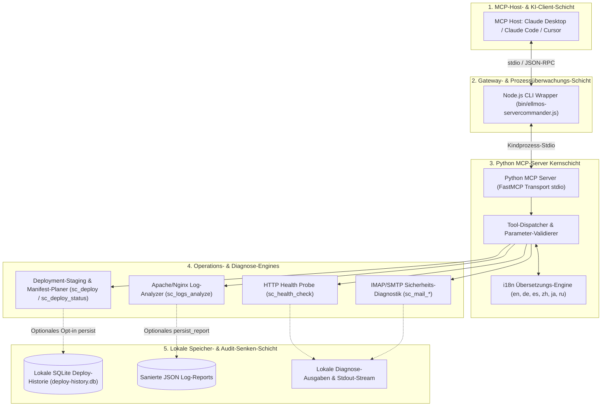
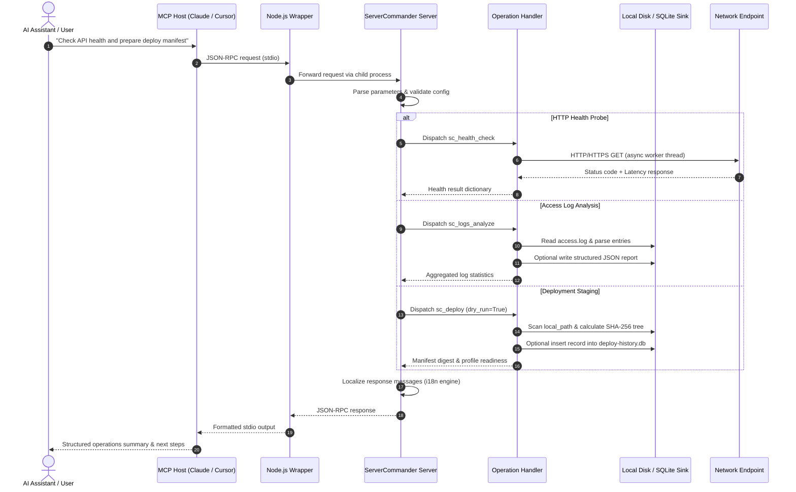

<p align="center">
  
</p>

# ellmos-servercommander-mcp

Alpha Model Context Protocol (MCP) Server für Local-First Server-Operationen: Deployment-Dry-runs, Mail-Konfigurationsstatus, Access-Log-Analyse und robuste HTTP-Health-Checks.

Englische Standard-README: [README.md](README.md)

*Teil der [ellmos-ai](https://github.com/ellmos-ai)-Familie unter dem Open-Source-Dach von [open-bricks](https://github.com/open-bricks).*

[](https://opensource.org/licenses/MIT)
[](https://www.npmjs.com/package/ellmos-servercommander-mcp)
[](.github/workflows/ci.yml)
[](tests/)
[](https://www.python.org/)
[](https://nodejs.org/)
[](.github/workflows/ci.yml)
[](https://modelcontextprotocol.io/)
[](https://www.npmjs.com/package/ellmos-servercommander-mcp)
[](SECURITY.md)
[](THIRD_PARTY_LICENSES.md)
[](THIRD_PARTY_LICENSES.md)
[](MARKETING-LOG.txt)
[-blue.svg)](SECURITY.md)
[](https://github.com/ellmos-ai)
[](https://github.com/open-bricks)
[](llms.txt)

> [!NOTE]
> **Auffindbarkeit & KI-Suche:** Veröffentlicht auf [npm](https://www.npmjs.com/package/ellmos-servercommander-mcp) als `ellmos-servercommander-mcp`, für MCP-Kataloge in [`server.json`](server.json), [`glama.json`](glama.json) und [`smithery.yaml`](smithery.yaml) beschrieben und für AI-Suche/Indexierung in [`llms.txt`](llms.txt) zusammengefasst.

---

## Schnellnavigation

1. [Übersicht & Management-Summary](#uebersicht--management-summary)
2. [Visuelle Architektur & Systemtopologie](#architektur-visualisiert)
3. [Betriebs-Lebenszyklus & Sequenzfluss](#end-to-end-operations-lebenszyklus)
4. [Zielgruppen & Discoverability-Suchanfragen](#marketing--zielgruppen)
5. [Vergleichsmatrix gegenüber Alternativen](#vergleichsmatrix--alternativen)
6. [Kernfähigkeiten & Sicherheitsinvarianten](#kernfähigkeiten--sicherheitsinvarianten)
7. [Einstieg & Schnellüberblick](#einstieg)
8. [Status & Protokoll-Unterstützung](#status--protokoll-unterstützung)
9. [Installation & Voraussetzungen](#installation)
10. [MCP-Client-Konfiguration & Bereitstellungsmodi](#mcp-client-konfiguration)
11. [Konfiguration & Profilspezifikation](#konfiguration--profile)
12. [Tools & Handler-Referenz](#tools--handler)
13. [Suche, Begriffsklärung & Schlüsselwörter](#suche--Begriffsklärung)
14. [Geschwister-Ökosystem & Matrix](#geschwister-ökosystem)
15. [Drittanbieter-Lizenzen & Level 1 SBOM](#drittanbieter-lizenzen--transparenz)
16. [Sicherheitsrichtlinie & Betriebsgrenzen (48h SLA)](#sicherheit--richtlinien)
17. [Entwicklung, Verifikation & CI-Matrix](#entwicklung--verifikation)
18. [Gesetzlicher Hinweis, Haftungsbeschränkung & Lizenz (§ 521 BGB)](#gesetzlicher-hinweis--haftungsbeschraenkung)

---

<a id="uebersicht--management-summary"></a><a id="core-identity"></a><a id="executive-summary--core-identity"></a>
## 1. Übersicht & Management-Summary

`ellmos-servercommander-mcp` ist ein autoritativer, lokaler Model Context Protocol (MCP) Server, der speziell für KI-Coding-Assistenten und autonome Agenten-Plattformen (Claude Code, Cursor, Codex, Antigravity, Gemini) entwickelt wurde. Er versetzt Agenten in die Lage, Servergesundheit zu diagnostizieren, Webserver-Access-Logs zu analysieren, Mail-Bereitschaften zu prüfen und Dry-Run-Deployment-Pläne zu berechnen, ohne Produktionsinfrastruktur unkontrollierten destruktiven Shell-Befehlen auszusetzen.

Alle Operationen folgen strikten Local-First- und Rechte-Garantien:
- **100% Local-First & Zero-Egress per Standard:** Diagnostische Log-Analysen und Manifest-Berechnungen laufen rein lokal; null Telemetrie und null unautorisierte ausgehende Netzwerkanfragen.
- **Dry-Run & Staging First:** Deployment-Operationen berechnen rekursive SHA-256-Baumhashes und prüfen Zielprofile vor jeglicher Remote-Ausführung.
- **Rechtefreie Ausführung (`RunAsInvoker`):** Läuft vollständig im unprivilegierten Benutzerraum ohne Administrator- oder Root/sudo-Rechte.

---

<a id="architektur-visualisiert"></a><a id="architecture-visualized"></a><a id="visuelle-architektur--systemtopologie"></a>
## 2. Visuelle Architektur & Systemtopologie

Das folgende Diagramm visualisiert die entkoppelten Schichten von ServerCommander, vom MCP-Host-Transport über Node.js-Prozessüberwachung bis zum Python-Dispatcher, den Diagnose-Engines und den lokalen Senken:


```mermaid
flowchart TD
    subgraph HostLayer ["1. MCP-Host- & KI-Client-Schicht"]
        Host["MCP Host: Claude Desktop / Claude Code / Cursor"]
    end

    subgraph GatewayLayer ["2. Gateway- & Prozessüberwachungs-Schicht"]
        NodeWrapper["Node.js CLI Wrapper (bin/ellmos-servercommander.js)"]
    end

    subgraph CoreLayer ["3. Python MCP-Server Kernschicht"]
        FastMCP["Python MCP Server (FastMCP Transport stdio)"]
        Dispatcher["Tool-Dispatcher & Parameter-Validierer"]
        i18nEngine["i18n Übersetzungs-Engine (en, de, es, zh, ja, ru)"]
    end

    subgraph OperationsLayer ["4. Operations- & Diagnose-Engines"]
        HTTPProbe["HTTP Health Probe (sc_health_check)"]
        LogAnalyzer["Apache/Nginx Log-Analyzer (sc_logs_analyze)"]
        DeployStaging["Deployment-Staging & Manifest-Planer (sc_deploy / sc_deploy_status)"]
        MailDiagnostics["IMAP/SMTP Sicherheits-Diagnostik (sc_mail_*)"]
    end

    subgraph SinkLayer ["5. Lokale Speicher- & Audit-Senken-Schicht"]
        SQLiteHist[("Lokale SQLite Deploy-Historie (deploy-history.db)")]
        JSONReports[("Sanierte JSON Log-Reports")]
        AuditSink["Lokale Diagnose-Ausgaben & Stdout-Stream"]
    end

    Host <-->|"stdio / JSON-RPC"| NodeWrapper
    NodeWrapper <-->|"Kindprozess-Stdio"| FastMCP
    FastMCP --> Dispatcher
    Dispatcher <--> i18nEngine
    Dispatcher --> HTTPProbe
    Dispatcher --> LogAnalyzer
    Dispatcher --> DeployStaging
    Dispatcher --> MailDiagnostics
    DeployStaging -.->|"Optionales Opt-in persist"| SQLiteHist
    LogAnalyzer -.->|"Optionales persist_report"| JSONReports
    HTTPProbe -.-> AuditSink
    MailDiagnostics -.-> AuditSink
```

---

<a id="end-to-end-operations-lebenszyklus"></a><a id="end-to-end-operations-lifecycle"></a><a id="betriebs-lebenszyklus--ausfuehrungs-sequenzfluss"></a>
## 3. Betriebs-Lebenszyklus & Sequenzfluss

Das folgende Sequenzdiagramm demonstriert den Ablauf von Operationen, die ein KI-Agent über ServerCommander ausführt, inklusive nebenläufiger HTTP-Probes, Log-Analysen und Dry-Run-Staging:


```mermaid
sequenceDiagram
    autonumber
    actor User as AI Assistant / User
    participant Host as MCP Host (Claude / Cursor)
    participant Wrapper as Node.js Wrapper
    participant Server as ServerCommander Server
    participant Handler as Operation Handler
    participant Disk as Local Disk / SQLite Sink
    participant Target as Network Endpoint

    User->>Host: "Check API health and prepare deploy manifest"
    Host->>Wrapper: JSON-RPC request (stdio)
    Wrapper->>Server: Forward request via child process
    Server->>Server: Parse parameters & validate config

    alt HTTP Health Probe
        Server->>Handler: Dispatch sc_health_check
        Handler->>Target: HTTP/HTTPS GET (async worker thread)
        Target-->>Handler: Status code + Latency response
        Handler-->>Server: Health result dictionary
    else Access Log Analysis
        Server->>Handler: Dispatch sc_logs_analyze
        Handler->>Disk: Read access.log & parse entries
        Handler->>Disk: Optional write structured JSON report
        Handler-->>Server: Aggregated log statistics
    else Deployment Staging
        Server->>Handler: Dispatch sc_deploy (dry_run=True)
        Handler->>Disk: Scan local_path & calculate SHA-256 tree
        Handler->>Disk: Optional insert record into deploy-history.db
        Handler-->>Server: Manifest digest & profile readiness
    end

    Server->>Server: Localize response messages (i18n engine)
    Server-->>Wrapper: JSON-RPC response
    Wrapper-->>Host: Formatted stdio output
    Host-->>User: Structured operations summary & next steps
```

---

<a id="marketing--zielgruppen"></a><a id="marketing--target-personas"></a><a id="zielgruppen--discoverability-suchanfragen"></a>
## 4. Zielgruppen & Discoverability-Suchanfragen

ServerCommander MCP schließt die kritische Lücke zwischen gefährlichen rohen Shell-Befehlen und unzugänglichen Web-Hosting-Panels. Der Server stattet KI-Agenten mit sicheren, strukturierten Diagnosewerkzeugen für die Serveradministration aus.

### Zielgruppen-Profile (Personas)

| Persona-ID | Zielgruppe | Herausforderung / Pain Point | ServerCommander MCP Lösung |
|---|---|---|---|
| `[PERSONA-01]` | **Autonome KI-Agent-Ingenieure & Tooling-Architekten** | Hohes Risiko destruktiver Bash-Befehle bei Agenten-Recherchen | Strukturierte JSON-RPC MCP-Tools mit strikt zerstörungsfreien Standards |
| `[PERSONA-02]` | **DevOps- & SRE-Ingenieure** | Unbemerkte Dateiabweichungen, fehlerhafte Releases & riskante Deploys | Deterministisches SHA-256-Tree-Hashing & lokale Dry-run-Deployment-Pläne |
| `[PERSONA-03]` | **Sicherheitsadministratoren & SecOps** | Credential-Leaks, Root-Eskalationsrisiken & verdächtige Traffic-Spikes | Rechtefreie RunAsInvoker-Ausführung, Secret-Isolation & forensische Log-Analyse |
| `[PERSONA-04]` | **Solo-Entwickler & Full-Stack Maintainer** | Aufwändiges manuelles Monitoring & zeitraubendes Log-Grep | Sofortige HTTP-Health-Checks & automatische Bot-/Fehler-Erkennung aus der IDE |

### High-Intent Suchbegriffe (SEO & Auffindbarkeit)

- `"mcp server verwaltung tools"`
- `"mcp deployment dry run server"`
- `"mcp access log analyse"`
- `"mcp http health check werkzeug"`
- `"local first server management mcp"`
- `"claude code server operationen"`
- `"sichere deployment planung mcp"`
- `"ki assistent server vorabpruefung"`
- `"apache nginx log analyse mcp"`
- `"sqlite deploy historie mcp"`

---

<a id="vergleichsmatrix--alternativen"></a><a id="comparative-matrix--alternatives"></a><a id="vergleichsmatrix-gegenueber-alternativen"></a>
## 5. Vergleichsmatrix gegenüber Alternativen

Die nachfolgende 10-Dimensionen-Matrix vergleicht ServerCommander mit gängigen Administrationsmethoden, direkt zugeordnet zu den Laufzeit- und Governance-Invarianten (`INV-LOCAL-01` bis `INV-SLA-10`):

| Dimension | Invariante | ServerCommander MCP | SSH / Rohe Bash-Skripte | Web-Panels (cPanel) | Cloud SaaS APM (Datadog) | Generisches Terminal MCP |
|:---|:---:|---|---|---|---|---|
| **1. Native KI-Integration** | `INV-I18N-08` | Direktes MCP stdio / JSON-RPC | Benötigt Prompt-Kleber | Keine / Browser-UI | Eigene API-Webhooks | Unstrukturierter Text |
| **2. Ausführungssicherheit** | `INV-DRY-02` | Standard `dry_run=True` + SHA-256 | Hohes Risiko durch Tippfehler | Intransparente Webmutation | Nur-Lese-Agent-Metriken | Willkürliche Shell-Gefahr |
| **3. Local-First / Egress** | `INV-LOCAL-01` | 100% Lokal / Zero-Egress | Lokal / Direkt remote | Remote-Webportal | Permanente Cloud-Telemetrie| Lokale Shell-Ausführung |
| **4. Rechteanforderungen** | `INV-PRIV-06` | Rechtefrei (`RunAsInvoker`) | Oft sudo-/Root-Bedarf | Vollständiger Root-Daemon | Root-Daemon / System-Agent | Host-Shell-Berechtigungen |
| **5. Forensische Log-Analyse**| `INV-LOG-03` | Regex-Token-Parsing + Bot-Audit | Manuelles grep / awk / sed | Einfache Log-Ansicht | Schwerer SaaS-Agent | Roher grep-Output |
| **6. Robuste HTTP-Probes** | `INV-PROBE-04` | Nicht-blockierend + batch-sicher | curl-Schleife (bricht ab) | Polling-Intervall | Zentraler externer Probe | curl-CLI-Kindprozess |
| **7. Sicheres Mail-Staging** | `INV-MAIL-05` | Bereitschaftsprüfung ohne Senden | Direktes Mail-Versandrisiko | Webmail-Oberfläche | E-Mail-Alarmdienst | Blinde mailx-Ausführung |
| **8. Prozess- & CWD-Schutz** | `INV-SEC-07` | `PYTHONSAFEPATH=1`-Härtung | Shell erbt unsicheres CWD | Fester Daemon-Benutzer | Isolierter Systemdienst | Erbt Aufruferumgebung |
| **9. Cloud-Sync-Konfliktschutz**| `INV-SYNC-09`| Integrierte Ignore- & Lock-Regeln | Keine (rein Git) | Nur Datenbankzustand | Cloud-Dashboard | Keine |
| **10. Sicherheits-SLA & Support**| `INV-SLA-10`| 48h SLA via security@ellmos.ai | Community / Eigenregie | Kommerzieller Support | Enterprise SLA | Ungepflegte Community |

---

<a id="kernfähigkeiten--sicherheitsinvarianten"></a><a id="key-capabilities--safety-invariants"></a><a id="governance--safety-invariants"></a>
## 6. Kernfähigkeiten & Sicherheitsinvarianten

| Invariante | Fähigkeit / Regel | Implementierungs-Garantie | Technische Details |
|---|---|---|---|
| **INV-LOCAL-01** | **100% Local-First & Zero-Egress** | Zerstörungsfreier diagnostischer Standard | Diagnosen & Dry-run-Planung laufen lokal ohne unautorisierte Remote-Telemetrie. |
| **INV-DRY-02** | **Ausfallsicheres Deployment-Staging** | Standard `dry_run=True` | Berechnet SHA-256-Manifeste und prüft Profile, bevor Zielsysteme berührt werden. |
| **INV-LOG-03** | **Bereinigte Access-Log-Analyse** | Forensisches Read-Only-Parsing | Regex-Token-Extraktion erkennt Fehler, Bots und Pfadtraversierungen ohne Secret-Leaks. |
| **INV-PROBE-04** | **Robuste Health-Probes** | Nicht-blockierende Worker-Threads | HTTP-Checks laufen via `asyncio.to_thread`; ungültige URLs brechen Batches niemals ab. |
| **INV-MAIL-05** | **Sichere Mail-Bereitschaftsdiagnose** | Ausführungsfreies sicheres Staging | Validiert IMAP/SMTP-Konfiguration und Logins ohne versehentlichen E-Mail-Versand. |
| **INV-PRIV-06** | **Rechtefreie Ausführung (Non-Elevation)** | Keine Root-/sudo-Rechte (RunAsInvoker) | Läuft vollständig mit regulären Nutzerrechten; erfordert niemals Administratorrechte. |
| **INV-SEC-07** | **Sichere Prozess- & Paketisolation** | Schutz vor Fremdpaketen im CWD | Launcher erzwingt `PYTHONSAFEPATH=1`, um Hijacking durch Arbeitsverzeichnispakete zu verhindern. |
| **INV-I18N-08** | **Native 6-Sprachen i18n Engine** | Vollständige mehrsprachige Parität | Lokalisierte Toolbeschreibungen, Schema-Argumente und Fehler für `en`, `de`, `es`, `zh`, `ja`, `ru`. |
| **INV-SYNC-09** | **Cloud-Sync-Konflikthärtung** | Multi-Host .gitignore-Abwehr | Gehärtet gegen OneDrive-/Dropbox-Konfliktkopien (`*-conflict-*`) und Multi-Agent-Locks (`LOCK*`). |
| **INV-SLA-10** | **Zweisprachige Sicherheits-SLA** | 48h Reaktionsgarantie | Schwachstellenmeldung mit 48h-Triage via `security@ellmos.ai` und `security@open-bricks.org`. |

---

<a id="einstieg"></a><a id="start-here"></a><a id="quick-guidance"></a>
## 7. Einstieg & Schnellüberblick

| Ziel | Einstieg | Kernfunktionen |
|---|---|---|
| ServerCommander in Claude Desktop, Claude Code, Cursor oder einen anderen MCP-Host einbinden | [MCP-Client-Konfiguration](#mcp-client-konfiguration) | Reibungslose globale npm-Installation oder npx-Aufruf |
| Einen öffentlichen oder internen HTTP-Endpunkt vor einem Deployment prüfen | `sc_health_check` | Parallele, nicht blockierende Anfragen, Latenzmessung, fehlertolerante Batch-Verarbeitung |
| Apache-/Nginx-Access-Logs nach Fehlern, Bots, Referern und verdächtigen Pfaden prüfen | `sc_logs_analyze` | Statuscode-Aufschlüsselung, Datenübertragungssummen, Bot-Erkennung, optionale JSON-Reports |
| Vor SFTP-/SSH-Ausführung ein deterministisches Deployment-Manifest im Dry-Run erstellen | `sc_deploy` und `sc_deploy_status` | Rekursives SHA-256-Baumhashing, Symlink-Traversierungsschutz, SQLite-Historie |
| Mail-Operationen vorbereiten, ohne heute versehentlich E-Mails zu versenden | `sc_mail_list`, `sc_mail_read`, `sc_mail_send`, `sc_mail_search` | Protokollbereitschaftsprüfung, Credential-Inspektion, sicheres Alpha-Staging |

---

<a id="status--protokoll-unterstützung"></a><a id="status--protocol-support"></a>
## 8. Status & Protokoll-Unterstützung

- **Transport**: Standard-Ein-/Ausgabe (`stdio`) über das Python-MCP-SDK und Node.js-Prozess-Wrapper.
- **Paketstatus**: Öffentliches Alpha-Paket unter der `ellmos-ai`-Organisation.
- **Aktiver Kern**: MCP-Tool-Listing, Tool-Dispatch, TOML-Konfigurationslader, HTTP-Health-Checks, erweiterte Access-Log-Analyse mit optional gespeicherten JSON-Reports und optionale lokale Deployment-Dry-run-Historie.
- **Sichere Alpha-Handler**: `sc_deploy` erstellt lokale SHA-256-Manifeste, Konfigurationsdiagnosen und opt-in SQLite-History-Einträge im Dry-Run-Modus; `sc_mail_*` meldet protokollspezifische IMAP-/SMTP-Bereitschaft ohne Standard-Verbindungsaufbau.
- **i18n-Lokalisierung**: Lokalisierte MCP-Tool-Beschreibungen, Input-Schema-Feldbeschreibungen und Unknown-Tool-Fehler für `en`, `de`, `es`, `zh`, `ja`, `ru` mit automatischem Englisch-Fallback.

---

<a id="installation"></a><a id="installation--prerequisites"></a>
## 9. Installation & Voraussetzungen

Das npm-Paket enthält einen Node-Wrapper, der den Python-Server startet. Voraussetzung bleibt Python 3.10+ mit installiertem Python-Paket `mcp>=1.0.0`.

### Option 1: Installation per npm

```powershell
npm install -g ellmos-servercommander-mcp@alpha
ellmos-servercommander
```

### Option 2: Installation aus dem Quellcode

```powershell
git clone https://github.com/ellmos-ai/ellmos-servercommander-mcp.git
cd ellmos-servercommander-mcp
$env:PYTHONIOENCODING = "utf-8"
python -m pip install -e ".[dev]"
python -m pytest -q
```

Vermeiden Sie `.venv`-Ordner innerhalb cloud-synchronisierter Verzeichnisse, falls der Sync-Client Dateien sperrt.

---

<a id="mcp-client-konfiguration"></a><a id="mcp-client-configuration"></a>
## 10. MCP-Client-Konfiguration & Bereitstellungsmodi

### Globale npm-Installation

```json
{
  "mcpServers": {
    "servercommander": {
      "command": "ellmos-servercommander"
    }
  }
}
```

### npx ohne Vorabinstallation

```json
{
  "mcpServers": {
    "servercommander": {
      "command": "npx",
      "args": ["-y", "ellmos-servercommander-mcp@alpha"]
    }
  }
}
```

### Direkte Python-Ausführung

```json
{
  "mcpServers": {
    "servercommander": {
      "command": "python",
      "args": ["-m", "servercommander.server"],
      "env": {
        "PYTHONPATH": "C:/Pfad/zu/ellmos-servercommander-mcp/src",
        "SERVERCOMMANDER_CONFIG_PATH": "C:/Pfad/zu/config/servercommander.toml"
      }
    }
  }
}
```

---

<a id="konfiguration--profile"></a><a id="configuration--profiles"></a>
## 11. Konfiguration & Profilspezifikation

ServerCommander durchsucht Konfigurationsdateien in dieser Prioritätenreihenfolge:

1. Umgebungsvariable `SERVERCOMMANDER_CONFIG_PATH`
2. `./servercommander.toml`
3. `./config/servercommander.toml`
4. `~/.config/servercommander/servercommander.toml`

Eine kommentierte Vorlage liegt unter [`config/servercommander.example.toml`](config/servercommander.example.toml).

```toml
[server]
name = "servercommander"
log_level = "INFO"
language = "de"

[deploy.profiles.staging]
target = "sftp://staging.example.com/var/www/app"
local_path = "./dist"
protocol = "sftp"
dry_run = true
record_history = true

[mail]
execution_enabled = false
smtp_host = "smtp.example.com"
smtp_port = 587
imap_host = "imap.example.com"
imap_port = 993
```

Zugangsdaten sollten stets über Umgebungsvariablen wie `$MAIL_PASSWORD` oder `$SFTP_PASSWORD` eingebunden werden.

---

<a id="tools--handler"></a><a id="tools--handlers"></a>
## 12. Tools & Handler-Referenz

- `sc_health_check`: Prüft HTTP/HTTPS-Endpunkte und liefert Statuscodes, Header und Latenzen. Ungültige URLs brechen Batches niemals ab, sondern werden sauber als Einzelfehler isoliert.
- `sc_logs_analyze`: Analysiert Apache/Nginx-Access-Logs aus Rohtext oder lokalen Dateien (Statusklassen, Transfervolumen, Top-Referrer, 404/500-Pfade, Bot-Erkennung und optionaler JSON-Reportexport via `persist_report`).
- `sc_deploy`: Berechnet Dry-Run-Deployment-Pläne mit lokalem SHA-256-Dateibaummanifest und Profildiagnostik ohne Zielmutationen. Verschachtelte Symlinks werden als `skipped_symlinks` sicher isoliert.
- `sc_deploy_status`: Zeigt konfigurierte Deployment-Profile, Profildiagnosen und die letzten Dry-Run-Einträge aus der lokalen SQLite-Historien-Datenbank an.
- `sc_mail_list`, `sc_mail_read`, `sc_mail_send`, `sc_mail_search`: Sichere Alpha-Diagnoseantworten zur IMAP/SMTP-Bereitschaft. Bei `[mail].execution_enabled = true` führt `sc_mail_list` einen schreibgeschützten IMAP-Erreichbarkeitstest über das bewährte `mail-connector`-Modul aus.

---

<a id="suche--Begriffsklärung"></a><a id="search-and-disambiguation"></a>
## 13. Suche, Begriffsklärung & Schlüsselwörter

ServerCommander ist der Operations-MCP-Server von ellmos für lokale Serveradministration. Relevante Suchbegriffe:

- mcp server verwaltung tools
- mcp deployment dry run server
- mcp access log analyse
- mcp http health check werkzeug
- local first server management mcp
- claude code server operationen
- sichere deployment planung mcp
- ki assistent server vorabpruefung
- apache nginx log analyse mcp
- sqlite deploy historie mcp

Es ist **nicht** der GitHub-MCP-Server, **kein** generischer Shell-Ausführungs-Server, **kein** Cloud-Hosting-Webpanel und **kein** ungeprüfter SFTP/IMAP-Auto-Executor. Die Alpha-Oberfläche ist strikt diagnostisch, dry-run-first und sicher per Standard.

---

<a id="geschwister-ökosystem"></a><a id="sibling-ecosystem"></a>
## 14. Geschwister-Ökosystem & Matrix

Dieser MCP-Server ist ein integraler Bestandteil des **[ellmos-ai](https://github.com/ellmos-ai)**-Ökosystems und der **[open-bricks](https://github.com/open-bricks)** Open-Source-Familie.

### MCP-Server-Familie

| Server | Tools | Hauptfokus | npm-Paket |
|---|---|---|---|
| [FileCommander](https://github.com/ellmos-ai/ellmos-filecommander-mcp) | 46 | Dateisystem, Prozessaufsicht, Sessions, Cloud-Lock-Behandlung | [`ellmos-filecommander-mcp`](https://www.npmjs.com/package/ellmos-filecommander-mcp) |
| [CodeCommander](https://github.com/ellmos-ai/ellmos-codecommander-mcp) | 22 | Codeanalyse, AST-Inspektion, JSON-Reparatur, Importe, Diffs, Regex | [`ellmos-codecommander-mcp`](https://www.npmjs.com/package/ellmos-codecommander-mcp) |
| [Clatcher](https://github.com/ellmos-ai/ellmos-clatcher-mcp) | 12 | Dateireparatur, Encoding-Korrektur, Formatkonvertierung, Batch-Tools | [`ellmos-clatcher-mcp`](https://www.npmjs.com/package/ellmos-clatcher-mcp) |
| [n8n Manager](https://github.com/ellmos-ai/n8n-manager-mcp) | 18 | n8n-Workflow-Verwaltung, Deployment, Node-Exploration | [`n8n-manager-mcp`](https://www.npmjs.com/package/n8n-manager-mcp) |
| [ControlCenter](https://github.com/ellmos-ai/ellmos-controlcenter-mcp) | 20 | MCP-Stack-Erkennung, Profilverwaltung, Control-Plane-Routing | [`ellmos-controlcenter-mcp`](https://www.npmjs.com/package/ellmos-controlcenter-mcp) |
| [Homebase](https://github.com/ellmos-ai/ellmos-homebase-mcp) | 45 | Lokales LLM-Gedächtnis, Wissensbasis, Schwarm-Orchestrierung | [`ellmos-homebase-mcp`](https://www.npmjs.com/package/ellmos-homebase-mcp) |
| **[ServerCommander](https://github.com/ellmos-ai/ellmos-servercommander-mcp)** | **8** | **Serveroperationen: Health-Checks, Log-Analyse, Dry-Run-Manifeste** | **[`ellmos-servercommander-mcp`](https://www.npmjs.com/package/ellmos-servercommander-mcp)** |
| [Blender Use](https://github.com/ellmos-ai/ellmos-blender-use-mcp) | 3 | Headless Blender 3D-Asset-QA und automatisierter FBX-Reimport | [`ellmos-blender-use-mcp`](https://www.npmjs.com/package/ellmos-blender-use-mcp) |
| [Open Compute](https://github.com/ellmos-ai/open-compute-mcp) | 10 | Modellagnostische Computer-Nutzung: Screen-Capture & Schutz-Gates | [`open-compute-mcp`](https://www.npmjs.com/package/open-compute-mcp) |

### KI-Infrastruktur & Entwickler-Werkzeuge

| Projekt | Beschreibung |
|---|---|
| [BACH](https://github.com/ellmos-ai/bach) | Lokales textbasiertes Betriebssystem für KI-Agenten — 113+ Handler, 550+ Tools, SQLite-Memory |
| [open-compute](https://github.com/ellmos-ai/open-compute) | Modellagnostischer Computer-Use-Kern hinter Open Compute MCP |
| [clutch](https://github.com/ellmos-ai/clutch) | Providerneutrales LLM-Gateway mit Auto-Routing und Budget-Tracking |
| [rinnsal](https://github.com/ellmos-ai/rinnsal) | Leichtgewichtige Agenten-Erinnerungen, Konnektoren und Automationsinfrastruktur |
| [sqlite-transit-sync](https://github.com/ellmos-ai/sqlite-transit-sync) | Verschlüsselte SQLite-Transitsynchronisation & additive Read-Replica-Engine |
| [workflowhooker](https://github.com/ellmos-ai/workflowhooker) | Git-Hook-getriebene Workflow-Automation und Sicherheitsgrenzen |
| [system-explorer](https://github.com/ellmos-ai/system-explorer) | Local-First Systemkomposition, Modul-Introspektion und Flottenverifikation |
| [companion-for-agy](https://github.com/ellmos-ai/companion-for-agy) | Antigravity-Entwicklerbegleiter & Telemetriebrücke |

### Desktop-Software-Suite

Unsere Partnerorganisation **[open-bricks](https://github.com/open-bricks)** stellt Desktop-Produktivitätsanwendungen für das KI-Zeitalter bereit:
- Dateiverwaltung: [ProFiler](https://github.com/file-bricks/ProFiler), [ExplorerPro](https://github.com/file-bricks/ExplorerPro), [CloudLockFixer](https://github.com/file-bricks/CloudLockFixer)
- Dokumentenverarbeitung: [DokuZen](https://github.com/doc-bricks/DokuZen), [PDFtoPDFocr](https://github.com/doc-bricks/PDFtoPDFocr), [FormularErstellen](https://github.com/doc-bricks/FormularErstellen)
- Entwickler-Tools: [DevCenter](https://github.com/dev-bricks/DevCenter), [CodeBox](https://github.com/dev-bricks/CodeBox), [automizer-for-claude-desktop](https://github.com/dev-bricks/automizer-for-claude-desktop)

---

<a id="drittanbieter-lizenzen--transparenz"></a><a id="third-party-licenses--transparency"></a><a id="third-party-licenses--level-1-sbom"></a>
## 15. Drittanbieter-Lizenzen & Level 1 SBOM

ellmos ServerCommander MCP baut ausnahmslos auf permissiven Open-Source-Grundlagen auf. Wir garantieren null versteckte Telemetrie, null proprietäre Binär-Blobs und null ungeprüfte dynamische Abhängigkeiten.

- **Direkte Laufzeit**: Python MCP SDK (`mcp>=1.0.0`, MIT-Lizenz, Anthropic PBC), Python-Standardbibliothek (PSFL-2.0).
- **Node CLI Wrapper**: `update-notifier` (BSD-2-Clause, Sindre Sorhus) für nicht-intrusive CLI-Update-Prüfungen.
- **Optionale Erweiterungen**: `paramiko` (LGPL-2.1) wird nur dann dynamisch importiert, wenn das optionale `[sftp]`-Extra explizit installiert wurde.
- **Entwicklungs-Werkzeuge**: `pytest` (MIT), `pytest-asyncio` (Apache-2.0), `ruff` (MIT/Apache-2.0), `hatchling` (MIT).
- **Audit-Protokoll & Level 1 SBOM**: Umfassende Lizenzangaben, Copyright-Hinweise und Local-First-Compliance-Garantien sind im [THIRD_PARTY_LICENSES.md](THIRD_PARTY_LICENSES.md) dokumentiert. Formale Urheberrechtsangaben finden sich in [NOTICE](NOTICE).

---

<a id="sicherheit--richtlinien"></a><a id="security--governance"></a><a id="security-policy--operational-limits"></a>
## 16. Sicherheitsrichtlinie & Betriebsgrenzen (48h SLA)

Details zu Schwachstellenmeldungen, Reaktions-SLAs und Local-First-Sicherheitsinvarianten finden sich in der zweisprachigen [SECURITY.md](SECURITY.md).

- **Sicherheitsmeldungen**: [GitHub Security Advisories](https://github.com/ellmos-ai/ellmos-servercommander-mcp/security/advisories) oder per E-Mail an `security@ellmos.ai` / `security@open-bricks.org`.
- **Reaktions-SLA**: Erstbewertung innerhalb von **48 Stunden**; Status-Updates innerhalb von 5 Werktagen.

---

<a id="entwicklung--verifikation"></a><a id="development--verification"></a>
## 17. Entwicklung, Verifikation & CI-Matrix

```powershell
# UTF-8 Kodierung setzen
$env:PYTHONIOENCODING = "utf-8"

# Vollständige Pytest-Suite ausführen
python -m pytest -v

# Ruff Linter ausführen
ruff check .

# Node CLI Smoke-Test prüfen
npm run smoke

# npm Paketprüfung (Dry-Run)
npm pack --dry-run
```

---

<a id="gesetzlicher-hinweis--haftungsbeschraenkung"></a><a id="statutory-notice--liability-limitation"></a><a id="lizenz"></a><a id="license"></a>
## 18. Gesetzlicher Hinweis, Haftungsbeschränkung & Lizenz (§ 521 BGB)

### Gesetzlicher Haftungsausschluss (§ 521 BGB Gefälligkeitsrecht)

Dieses Open-Source-Softwareprodukt wird als **unentgeltliche Schenkung** im Sinne der §§ 516 ff. BGB bereitgestellt. Gemäß **§ 521 BGB** ist die Haftung des Urhebers und der Beitragenden auf **Vorsatz und grobe Fahrlässigkeit** beschränkt. Ergänzend gelten die nachstehenden Haftungsausschlüsse der MIT-Lizenz.

Nutzung auf eigenes Risiko. Keine Wartungsverpflichtung, keine Verfügbarkeitszusicherung, keine Gewähr für Fehlerfreiheit oder Eignung für einen bestimmten Einsatzzweck.

### Englische Zusammenfassung (English Summary)

This project is an unpaid open-source donation. In accordance with § 521 of the German Civil Code (BGB), liability is restricted strictly to cases of intentional misconduct and gross negligence. Supplemental liability disclaimers are set forth in the MIT License below.

Use entirely at your own risk. No maintenance commitments, no availability guarantees, and no warranties regarding fitness for any particular purpose.

### Lizenz & Urheberrecht

Lizenziert unter den Bedingungen der [MIT-Lizenz](LICENSE).<br>
Copyright (c) 2026 Lukas Geiger. Siehe [LICENSE](LICENSE) und [NOTICE](NOTICE) für vollständige Angaben.<br>
Drittanbieter-Lizenzen und Level 1 SBOM sind in [THIRD_PARTY_LICENSES.md](THIRD_PARTY_LICENSES.md) auditiert.
